# 昇腾CI 联邦集群功能设计文档

# 1 功能域背景与目的

## 1.1 目标与职责

**业务场景。** vLLM 社区在 PR 高峰期每天可能提交超过 50 个 PR，单个 PR 的 CI 验证平均需要约 36 张 NPU 卡。项目集群按用途独立部署时，某个集群的 Runner 需求可能暂时超过本地供给，而其他集群仍有可用执行资源。开发者不应通过修改 Workflow 或手动选择集群来适配平台内部部署变化。

**设计目标。** 使用 ARC 统一管理 Runner 生命周期，使用 Karmada 将 Runner Pod 纳入多成员 Kubernetes 集群管理。开发者继续使用平台提供的 Runner 标签；Karmada 根据平台配置的传播策略选择目标成员，并将 Runner Pod 及必要依赖传播到该成员。成员 Kubernetes 执行 Runner，状态经 Karmada 返回管理面。

**职责：** ARC 负责 Runner 需求、创建、注册与回收；Karmada 负责成员管理、Runner Pod 成员选择、资源传播和状态协调；成员 Kubernetes 负责 Pod 运行与节点调度。GitHub Actions 保持 Job 匹配和结果管理权。

## 1.2 边界

**包含：** ARC 与 Karmada 的联邦集成，包括统一 Runner 入口、成员范围配置、Runner Pod 传播、JIT Secret 依赖传播、Listener 跨控制面认证、成员 Pod 状态反馈和临时资源回收。

**不包含：** 自定义跨成员容量仲裁、公平队列、资源预留、NPU 拓扑选择、跨成员 Gang 调度、GitHub Job 队列管理和运行中 Job 无损迁移。

**成员职责：** NPU 工作负载的资源请求、设备插件、驱动/CANN、Volcano/Gang 和节点拓扑由成员集群负责。本仓库只定义 Runner 联邦放置所需的集成约束，不替代成员调度栈。

## 1.3 目标

开发者使用统一 Runner 标签提交 Workflow。ARC 根据 GitHub Job 需求创建 Runner；Karmada 根据 PropagationPolicy 选择允许的成员集群并传播 Runner Pod；成员 Kubernetes 启动 Runner 并执行 Workflow。Karmada 将成员 Pod 状态同步到管理面，ARC 按原生生命周期回收 Runner。

资源共享的边界是 Runner 执行实例的跨成员放置。该机制不代表 Karmada 能识别后续 NPU 工作负载的完整设备需求，也不承诺按 NPU 空闲卡数选择成员。

## 1.4 整体架构

图 1-2 ARC 与 Karmada 联邦集群整体架构

**职责划分：** ARC 管理 GitHub Job 对应的 Runner 需求与生命周期；Karmada 管理成员集群、选择目标成员、传播 Runner 资源及其依赖，并协调成员对象状态；成员 Kubernetes 调度 Runner Pod，Volcano（如部署）负责 Gang 等成员内调度，kubelet/Device Plugin 完成节点执行与设备分配。

**核心链路：** GitHub Actions 将任务需求交给 ARC；ARC 创建和管理 Runner 资源；Karmada Scheduler 根据传播策略选择成员集群，Karmada 将 Runner Pod 及必要依赖传播到目标成员；成员 Kubernetes 执行 Runner，并将对象状态反馈至 Karmada，ARC 据此推进 Runner 生命周期。JIT Secret 等敏感依赖按目标成员范围传播。

**边界：** 本功能域提供 ARC 与 Karmada 的联邦集成。成员选择由 Karmada 原生调度机制及传播策略承担；NPU 设备分配由成员 Kubernetes 及设备插件负责。

| 外部子系统 | 方向 | 交互内容 |
|---|---|---|
| GitHub Actions | 双向 | Job 需求、Runner 注册、执行状态和结果 |
| 配置与身份系统 | 输入 | RunnerScaleSet、PropagationPolicy、RBAC、TLS 与依赖传播配置 |
| 镜像仓库 | 输入 | Runner 镜像及 Workflow 所需镜像 |
| 监控与审计系统 | 输出 | ARC/Karmada/成员集群状态、事件与诊断数据 |

## 1.5 关键约束

- Runner 工作流使用 `runs-on: karmada-runner`。标签对应一个已注册 Scale Set。
- Scale Set 版本标签与选定的官方 ARC Controller 版本保持一致；仓库当前 0.15.0 为配置示例。
- Listener 运行在成员集群，通过独立 Token、CA 和 DNS 配置访问 Karmada API。
- Runner Pod 的 JIT Secret 必须传播至同一执行成员；传播过程允许短暂异步等待。
- Karmada Pod 状态解释器保留 `containerStatuses[].name` 和 `conditions`。
- `Divided / Weighted` 针对单个资源对象执行。多个独立 Pod 不保证逐轮均匀分布。
- 成员 Kubernetes 负责节点调度。NPU 任务需额外核实节点标签、设备插件、资源请求和工作负载运行环境。

# 2 功能域概述

## 2.1 定位、使用者和边界

本功能域将 ARC 管理的 Runner Pod 纳入 Karmada 联邦控制面。外部使用者通过统一 Runner 标签提交 Workflow；平台运维维护 ARC、Karmada、成员范围、凭证和传播策略；资源供应方维护成员 Kubernetes 集群及其执行环境。

GitHub 负责 Job 匹配和执行结果；ARC 负责 Runner 生命周期；Karmada 负责成员选择、资源传播和状态协调；成员 Kubernetes 负责实际 Pod 调度和运行。

## 2.2 核心特性

核心能力是让开发者使用统一 Runner 服务，并将合格的空闲资源从按项目隔离的集群中释放出来供授权任务使用。

**FT-01 统一入口与资源共享。** vLLM 开发者保留原有工作流标签；Runner 可在授权的 vLLM-Omni 等成员集群运行，开发者无须选择集群。

**FT-02 策略约束的成员放置。** 平台通过 PropagationPolicy 定义 Runner Pod 的候选成员范围，由 Karmada Scheduler 根据策略和成员状态选择目标成员。该能力仅提供策略约束下的成员选择，不提供跨成员公平队列或 NPU 容量预留。

**FT-03 跨控制面执行。** 被放置到其他成员的 Runner 必须获得对应 JIT 注册信息，且 Listener 能访问 Karmada API、运行状态能反馈给 ARC；未就绪 Runner 不应报告为可执行。

**FT-04 临时资源回收。** PR 检查结束后回收临时 Runner、传播对象与敏感依赖，释放成员集群中的执行资源。

**执行链路：统一入口 → 成员选择 → 跨集群执行与状态反馈 → 资源回收。**

**FT-05 成员执行环境兼容。** 平台维护成员集群的 Runner 镜像、CPU 架构、网络、存储和运行时兼容信息；NPU 工作负载的资源准入、拓扑与 Gang 调度由成员集群负责。

## 2.3 需求与用例追踪

需求从统一 Runner 入口、Runner 跨成员放置、依赖传播、执行状态反馈及资源回收等业务场景分解。以下编号用于需求到组件、接口和故障处理的追踪；业务需求正式编号尚未提供。

| 编号 | 定义与粒度 | 使用范围 |
|---|---|---|
| **IR** | 功能级需求：描述平台必须提供的独立业务能力 | IR-01～IR-04 为能力需求；与 F 功能实现单元可多对多关联，不把上游组件直接当作 IR |
| **FT** | 功能域特性：对外可感知的能力归类 | FT-01～FT-05 组织 IR 和 SR，不替代需求验收 |
| **SR** | 场景级需求：描述某一条件下必须实现的行为与验收依据 | SR-xx-xx 和 SR-NF-xx；一个 IR 可关联多个 SR |
| **UC** | 用例：具有参与者、前置条件、主/异常路径的行为场景 | UC-01～UC-14；一个 SR 可由多个 UC 展示 |
| **F** | 功能实现单元：第 5 章可独立评审的设计职责 | F-01～F-06 均为功能设计单元；F-06 定义成员执行环境兼容约束 |
| **AR** | 迭代实现/合入单元：由已批准 SR 分解得到的最小实现变更 | 尚未分配编号 |
| **SP** | 跨功能域设计规格：多个 F 共同遵守的行为/接口约束 | SP-01～SP-09 在第 4 章定义，供第 5 章引用 |

**追踪关系：** IR → SR → UC/F → SP/接口/DFX；AR 在迭代分解时关联 SR。

| 需求意图 | 核心场景 | SR | 特性与功能 |
|---|---|---|---|
| IR-01 跨成员资源共享 | UC-01 统一提交；UC-03 按需供给 | SR-01-01、SR-02-01 | FT-01；F-01、F-02 |
| IR-02 可控成员放置 | UC-05 成员选择；UC-10 无合格成员 | SR-03-01 | FT-02；F-03 |
| IR-03 跨控制面执行 | UC-06 凭证未就绪；UC-08 访问控制；UC-09 状态反馈 | SR-03-02、SR-04-01、SR-05-01 | FT-03；F-03～F-05 |
| IR-04 临时资源回收 | UC-04 作业结束；UC-12 状态或清理异常 | SR-02-02 | FT-04；F-02、F-03、F-05 |
| IR-05 成员执行环境兼容 | UC-07 Runner 执行；UC-13 成员环境不兼容；UC-14 成员内多节点工作负载 | SR-06-01～03 | FT-05；F-03、F-06 |

**用例概览：**

图 2-1 联邦 Runner 执行功能域主要用例

说明：用例涵盖统一入口、跨成员执行与回收；成员内 NPU 资源调度由成员集群负责。

> 图示为既有用例概要；成员内 NPU 资源调度不属于本功能域，Pod、Secret 与状态处理见第 5 章。

## 2.4 需求 SR

以下需求定义具体触发场景、系统预期行为和可观察的判定结果；对应组件及接口见第 4、5 章。

### 2.4.1 功能需求

| SR | 场景 | 必须满足的行为 | 判定方法 | 来源与现状 |
|---|---|---|---|---|
| **SR-01-01** | 开发者通过统一 Runner 服务提交作业。 | 作业可在授权成员执行，无需指定集群。 | 工作流不含成员信息；作业在允许的成员运行。 | FT-01；统一标签已配置 |
| **SR-02-01** | 有待执行作业，且未达容量上限。 | 按需创建临时 Runner，在选定成员执行。 | Runner 数量随需求变化；执行成员符合策略。 | FT-01/FT-04；复用 ARC |
| **SR-03-01** | Runner 服务可使用多个成员。 | 按平台策略选择成员，不得使用被禁止的成员；无需修改工作流。 | 变更候选集后，新 Runner 只在允许的成员运行。 | FT-02；已配置成员范围，未实现复杂容量调度 |
| **SR-03-02** | 执行成员已选定，注册信息尚未就绪。 | 注册信息可用后才能将 Runner 判为可执行。 | 凭证缺失时保持未就绪或报告启动错误。 | FT-03；依赖上游传播 |
| **SR-04-01** | 成员中的 Listener 访问统一控制面。 | 凭有效身份处理所属任务；连接或授权失败不得报成功。 | 可正常更新所属 Runner 服务；错误类别可区分。 | FT-03；已配置 Token/CA/RBAC，轮换未实现 |
| **SR-05-01** | 成员 Runner 启动、就绪或异常。 | 将真实状态反馈到管理面；未就绪不得判为就绪。 | 管理面与成员状态一致，保留关键状态字段。 | FT-03；单成员状态解释 |
| **SR-02-02** | 作业结束。 | 回收临时执行资源；失败时保留残留对象及错误。 | 资源进入回收流程；可定位异常残留。 | FT-04；复用 ARC/Karmada |
| **SR-06-01** | Runner Pod 需要放置到不同成员集群。 | 传播策略限定兼容成员；Karmada 根据成员状态完成成员选择。 | 目标成员符合策略标签和成员资格；不兼容成员不应成为候选。 | FT-05；F-03/F-06 |
| **SR-06-02** | 成员集群的 Runner 执行环境发生变化。 | 平台更新成员能力标签和传播策略；后续 Runner 按更新后的成员范围放置。 | 不兼容成员从候选范围移除；已运行 Job 不因标签变化自动迁移。 | FT-05；F-06 |
| **SR-06-03** | 成员 Runner Pod 无法启动或运行。 | 通过成员 Pod events、镜像状态、节点条件和网络/存储检查定位原因；由成员运维恢复。 | 可关联目标成员、Pod UID 和失败原因；不将 Runner Pod Ready 推导为 NPU 工作负载可调度。 | FT-05；F-06 |

SR-01-02 属 GitHub 原生匹配异常，不列为核心 SR。SR-06-01～03 描述成员执行环境兼容场景，不定义跨成员 NPU 资源准入。

### 2.4.2 非功能需求

| SR | 属性 | 要求 | 判定方法 | 实现边界 |
|---|---|---|---|---|
| **SR-NF-01** | 跨控制面访问安全 | 拒绝未授权访问；不得关闭 TLS 校验。 | 验证授权、未授权身份及证书校验。 | 受限 RBAC/CA 已配置；Controller 权限待收敛 |
| **SR-NF-02** | 跨成员凭证隔离 | 长期 GitHub 管理凭证只提供给实际消费者；临时凭证只供执行成员使用。 | 核对凭证消费者和传播范围。 | **目标未满足**：当前向两个成员分发管理凭证 |
| **SR-NF-03** | 成员故障边界 | 不可用成员的未就绪 Runner 不得作为可执行资源；不承诺运行中 Job 无损迁移。 | 检查成员失联后的 Runner 状态。 | 尚无自动故障迁移依据 |
| **SR-NF-04** | 跨集群问题定位 | 可关联 Job、Runner、执行成员及传播、注册、状态异常。 | 根据 Job 标识查找成员与故障阶段。 | 已有检查脚本，暂无统一查询入口 |
| **SR-NF-05** | 容量与排队性能 | 不得突破 ARC Runner 数量上限；区分 GitHub Job 等待、ARC Runner 供给、Karmada 成员放置和成员 Pod 启动。 | 对照各阶段权威事件与对象状态；缺失样本不得填零。 | 等待指标按 GitHub、ARC、Karmada、成员 Pod 阶段分别统计 |
| **SR-NF-06** | 资源使用与成本 | 无待执行作业且允许零空闲时，应能回收 Runner；成员无需各部署 ARC Controller。 | 检查缩至零和成员部署方式。 | 能力依赖配置和上游；节约目标待定 |
| **SR-NF-08** | 放置策略可维护性 | 可调整候选成员，不要求开发者修改 Runner 服务名称。 | 修改并恢复策略，核对后续执行成员。 | 策略可配置，未开发管理 UI |

### 2.4.3 待定指标

| 参数 | 指标 | 待确认内容 | 状态 |
|---|---|---|---|
| P-SR-01 | Runner 准备耗时 | 起止事件、窗口、分位数、阈值 | 未确定 |
| P-SR-02 | Job 排队与联邦放置等待 | 分别统计 GitHub queued→started、ARC Runner 创建、Karmada 放置与 Work 分发、成员 Pod 启动耗时；样本量、分位数和阈值待业务批准。 | 未批准 |
| P-SR-03 | 成员故障后的新作业执行 | 备用成员条件、故障检测、恢复目标；不含运行中 Job 迁移 | 未确定 |
| P-SR-04 | 资源利用率与成本 | 负载、共享前基线、计量方法、目标值 | 未确定 |

未批准的指标不得作为验收目标；不承诺未经验证的收益。

### 2.4.4 特性与设计追踪

| 特性 | 功能 SR | 非功能 SR | 设计单元 |
|---|---|---|---|
| FT-01 统一入口与共享 | SR-01-01、SR-02-01 | SR-NF-05、SR-NF-06 | F-01～F-03 |
| FT-02 可控成员放置 | SR-03-01 | SR-NF-03、SR-NF-08 | F-03 |
| FT-03 跨控制面执行 | SR-03-02、SR-04-01、SR-05-01 | SR-NF-01、SR-NF-02、SR-NF-04 | F-03～F-05 |
| FT-04 临时资源回收 | SR-02-02 | SR-NF-04、SR-NF-06 | F-02、F-03、F-05 |
| FT-05 成员执行环境兼容 | SR-06-01～03 | SR-NF-03～05、SR-NF-08 | F-03、F-06 |

**现状：** 当前 Manifest 通过 PropagationPolicy 配置成员范围；Karmada Scheduler 负责目标成员选择。成员内 NPU 资源调度由成员集群负责。

## 2.5 非目标

- 不重建 GitHub Job 匹配、队列排序和结果存储；UC-02 仍保留异常说明。
- 不涉及 Runner 沙箱、虚拟机、工作负载强隔离或云平台安全选型；必要的联邦 API 鉴权、凭证传播与放置权限仍属集成契约。
- ARC/Karmada 内部实现见第 4、5 章，不另列核心 SR。
- 本方案不开发 NPU Device Plugin、硬件驱动或跨成员多 Pod Gang；NPU 资源规格、成员容量准入与成员内调度接口属于 F-06 正式范围。
- 不承诺运行中 Job 无损迁移或独立 Runner 逐轮均衡分配。
- 企业级可用性、通用升级、成本预算和监控产品选型不另列核心 SR。

# 3 功能域总体方案

## 3.1 设计原则

**职责分离。** GitHub Actions 管理 Job 匹配和执行结果；ARC 管理 Runner 需求、创建、注册与回收；Karmada 管理成员集群、Runner 资源的成员选择、传播和状态协调；成员 Kubernetes 管理 Pod 调度与运行。成员侧 Volcano、Device Plugin 等组件按实际工作负载需要提供 Gang 调度和设备分配。

**复用上游控制器。** ARC 与 Karmada 保持各自原生资源模型和控制循环。本功能域通过 RunnerScaleSet、PropagationPolicy、RBAC、依赖传播配置和状态解释配置完成集成，不另建联邦调度控制器，不接管上游对象的生命周期。

**单一职责的放置决策。** Runner Pod 的目标成员由 Karmada Scheduler 根据 PropagationPolicy 和成员状态决定。平台通过策略限定候选成员，不在 Karmada 之外维护第二套成员选择逻辑。

**异步协调。** ARC 创建 Runner 资源、Karmada 生成 Binding/Work、成员创建 Pod、状态回传均由独立控制器异步完成。设计明确对象关联、状态权威、重试条件和清理责任，不假设跨 API 原子事务或 exactly-once 执行。

**最小权限与最小传播。** Listener 仅获得访问 Karmada 所需的身份和 API 权限；Runner 执行凭证按 Pod 引用传播到目标成员；GitHub 管理凭证仅保留在实际需要它的管理组件所在范围。

**成员自治。** Karmada 选择成员集群；成员 Kubernetes 选择节点。NPU 资源、拓扑、Gang 和 Device Plugin 的可行性由成员集群现有调度栈处理，不由本功能域进行跨成员容量预留。

## 3.2 备选方案与最终选型

| 方案 | 架构 | 优点 | 限制 |
|---|---|---|---|
| A：成员独立 ARC | 每个成员集群部署独立 ARC 和 RunnerScaleSet | 组件边界简单，成员自治 | 多个独立 ScaleSet 的 Job 匹配由 GitHub 处理，平台不能通过一个统一联邦策略控制 Runner Pod 的目标成员 |
| B：ARC + Liqo | ARC 与 Liqo 跨集群资源/网络机制集成 | 提供跨集群资源和网络抽象 | 引入额外资源映射与网络治理；不是本仓库当前采用的联邦控制面 |
| **C：ARC + Karmada（选定）** | ARC 统一管理 Runner 生命周期，Karmada 选择成员并传播 Runner 资源 | 复用 Karmada 成员管理、PropagationPolicy、Binding/Work 和依赖传播机制；成员范围由平台策略控制 | 需要完成 ARC API 访问、JIT Secret 传播、Pod 状态解释及回收行为的集成验证；不提供跨成员 NPU 容量仲裁 |

**选型结论：** 采用 ARC + Karmada。ARC 保持 Runner 生命周期控制权；Karmada Scheduler 根据策略和成员状态选择目标集群；成员 Kubernetes 执行 Runner Pod。成员 NPU 调度能力不属于本功能域。

### 3.2.1 Job 匹配与 Runner Pod 放置的边界

1. GitHub Actions 根据 Workflow 的 `runs-on`、Runner Group 和注册信息匹配 Job。
2. ARC Listener 接收 GitHub 的 Job Available 消息，并通过 ARC 控制器调整 Runner 期望数量。
3. ARC 创建的 Runner Pod 由 Karmada 管理；Karmada Scheduler 根据 PropagationPolicy 选择成员集群。
4. 成员 Kubernetes 在选定集群内为 Runner Pod 选择节点。
5. Runner 注册并执行 Job；GitHub 管理 Job 的最终状态。

GitHub Job 匹配与 Karmada Pod 放置属于不同控制过程。Karmada 选择成员不代表它重新分配 GitHub Job，也不代表一个已运行 Job 可以迁移到其他成员。

## 3.3 端到端实现思路

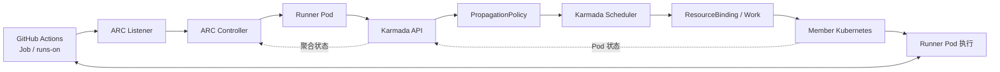
```mermaid
flowchart LR
    GH["GitHub Actions<br/>Job / runs-on"] --> L["ARC Listener"]
    L --> C["ARC Controller"]
    C --> RP["Runner Pod"]
    RP --> K["Karmada API"]
    K --> PP["PropagationPolicy"]
    PP --> S["Karmada Scheduler"]
    S --> B["ResourceBinding / Work"]
    B --> M["Member Kubernetes"]
    M --> R["Runner Pod 执行"]
    M -. "Pod 状态" .-> K
    K -. "聚合状态" .-> C
    R <--> GH
```

图 3-1 ARC 与 Karmada 联邦 Runner 主路径

说明：ARC 创建和管理 Runner；Karmada 选择成员并传播资源；成员 Kubernetes 运行 Pod 并反馈状态。

**处理阶段：**

| 阶段 | 处理 | 责任组件 |
|---|---|---|
| 任务匹配 | 根据 runs-on 和 Runner Group 匹配 Job | GitHub Actions |
| Runner 供给 | 接收 Job Available，调整 Runner 期望数量并创建临时 Runner | ARC |
| 成员选择 | 根据传播策略、成员资格和调度状态选择目标成员 | Karmada Scheduler |
| 资源传播 | 创建成员 Work，传播 Runner Pod 及声明的依赖 | Karmada |
| 节点调度 | 在目标成员内选择节点并启动 Pod | Kubernetes |
| Runner 执行 | 注册 Runner、领取 Job、执行 Workflow | Runner / GitHub Actions |
| 状态反馈 | 获取成员 Pod 状态并同步到管理面 | Karmada / ARC |
| 资源回收 | 按 ARC 与 Karmada 原生生命周期清理临时对象 | ARC / Karmada |

## 3.4 组件与逻辑架构

### 3.4.1 逻辑架构

图 3-2 ARC 与 Karmada 联邦集群逻辑架构

| 架构构件 | 职责 | 输入与输出 |
|---|---|---|
| GitHub Actions | Job 匹配、Runner 分配及执行结果管理 | Workflow、runs-on、Job 状态 |
| ARC Listener | 接收 Job Available 消息并触发 Runner 扩缩 | GitHub 任务需求、ERS 期望数量 |
| ARC Controller | 管理 RunnerScaleSet、EphemeralRunnerSet、EphemeralRunner 和 Runner Pod 生命周期 | ARC 自定义资源、Runner Pod、JIT 配置 |
| Karmada API / Controller | 接收联邦资源，维护 Binding/Work 和成员资源状态 | Runner Pod、PropagationPolicy、成员对象 |
| Karmada Scheduler | 按策略和成员状态选择 Runner Pod 的目标成员 | 候选成员、调度约束、放置结果 |
| Member Kubernetes | 接收 Work、创建/维护成员 Pod，并执行节点调度 | 成员 Pod、Pod 状态、节点状态 |
| 成员执行组件 | 按工作负载要求提供容器运行、Gang 和设备能力 | Runner 工作负载及其资源请求 |

**边界：** 本功能域的自定义设计集中在 ARC 与 Karmada 的 API、身份、依赖传播、状态解释和生命周期集成。Karmada Scheduler 的内部算法、成员 kube-scheduler、Volcano 和 Device Plugin 不在本仓库重新实现。

### 3.4.2 周边依赖

| 周边元素 | 交互关系 | 约束 |
|---|---|---|
| GitHub Actions | 提供 Job Available 消息和 Runner 注册/执行服务 | 由 GitHub 管理 Job 匹配和结果 |
| 镜像仓库 | 提供 ARC、Runner 和 Workflow 所需镜像 | 镜像版本与 digest 可追溯 |
| 密钥系统 | 提供 GitHub 凭证、Listener Token 和 CA | Secret 不进入日志或 Git |
| 部署系统 | 部署 ARC、Karmada 配置及成员策略 | 配置可审计、可回滚 |
| Prometheus / 日志系统 | 采集控制器、API、Pod 和传播状态 | 指标与日志使用稳定对象标识，不记录凭证值 |
| 成员 Kubernetes | 承载 Runner Pod 并反馈运行状态 | 成员集群保持独立调度和设备管理 |

## 3.5 领域数据模型和归属

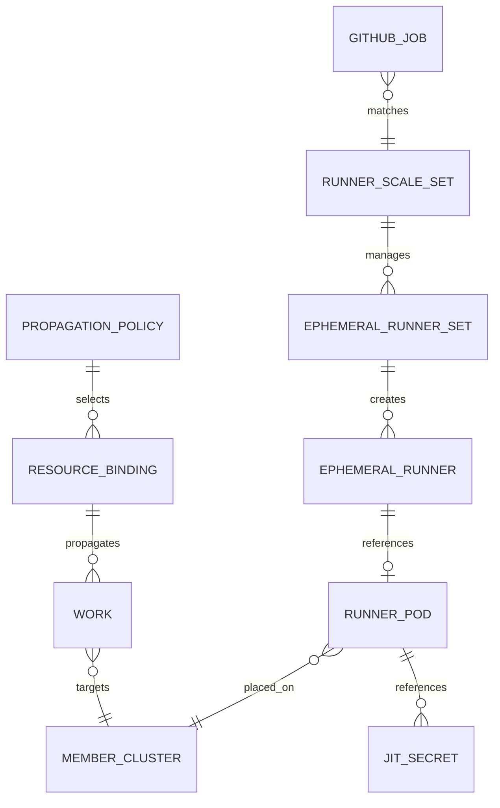
```mermaid
erDiagram
  GITHUB_JOB }o--|| RUNNER_SCALE_SET : matches
  RUNNER_SCALE_SET ||--o{ EPHEMERAL_RUNNER_SET : manages
  EPHEMERAL_RUNNER_SET ||--o{ EPHEMERAL_RUNNER : creates
  EPHEMERAL_RUNNER ||--o| RUNNER_POD : references
  RUNNER_POD }o--|| MEMBER_CLUSTER : placed_on
  RUNNER_POD ||--o{ JIT_SECRET : references
  PROPAGATION_POLICY ||--o{ RESOURCE_BINDING : selects
  RESOURCE_BINDING ||--o{ WORK : propagates
  WORK }o--|| MEMBER_CLUSTER : targets
```

图 3-3 ARC 与 Karmada 领域对象关系

说明：图中连线表示业务引用和联邦传播关系，不代表所有权或级联删除关系。

| 对象 | 权威生产者 | 主要关联 | 生命周期与处置 |
|---|---|---|---|
| GitHub Job | GitHub Actions | Workflow、RunnerScaleSet | 由 GitHub 管理；不受 Kubernetes GC 控制 |
| AutoscalingRunnerSet | 平台声明，ARC 调谐 | Runner 服务、Listener | 长期配置；按 ARC 生命周期维护 |
| AutoscalingListener / Listener Pod | ARC | RunnerScaleSet | 随 ScaleSet 生命周期；Token/CA 单独轮换 |
| EphemeralRunnerSet | ARC | AutoscalingRunnerSet | 动态期望副本；由 ARC 调谐和删除 |
| EphemeralRunner | ARC | EphemeralRunnerSet、Runner Pod | 单次 Runner 生命周期；由 ARC 管理 |
| Runner Pod | ARC 创建，Karmada 传播 | EphemeralRunner、目标成员 | 临时执行对象；ARC 发起生命周期回收，Karmada 协调成员副本删除 |
| JIT Secret | ARC | Runner Pod 的 Secret 引用 | 敏感临时数据；传播到目标成员，按引用和控制器行为清理 |
| GitHub 管理凭证 | 密钥管理员 | ARC 管理组件 | 长期敏感数据；按轮换/撤销流程管理 |
| PropagationPolicy | 平台声明，Karmada 消费 | 资源选择器、成员约束、依赖传播 | 长期配置；不代表资源所有权 |
| ResourceBinding / Work | Karmada | Runner Pod、目标成员 | 随资源传播生命周期管理；Work 分发不等于 Pod Ready |
| MemberCluster | Karmada | 成员 Kubernetes API | 长期成员对象；状态由 Karmada 采集 |
| 成员 Pod.status | 成员 Kubernetes / kubelet | 成员 Pod UID | 运行状态权威事实；经 Karmada 同步到管理面 |

### 3.5.1 对象标识与权威事实

- GitHub Job 使用 repository、run_id、job_id 和 run_attempt 等可用标识。
- ARC 对象使用 API group、namespace、name、UID 标识；名称不能替代 UID。
- 控制面 Pod 与成员 Pod 分别使用各自集群上下文和 UID 关联；不能假设跨集群 UID 相同。
- Karmada ResourceBinding/Work 使用其 API 身份和目标成员字段关联传播对象。
- Secret 通过 Pod 的 Secret 引用关联；业务关联不能替代 OwnerReference。
- GitHub 是 Job 结果的权威来源；ARC 是 Runner 生命周期的权威来源；Karmada 是传播与目标成员状态的权威来源；成员 Kubernetes 是真实 Pod/Node 状态的权威来源。

对象状态冲突时保留来源、UID 和观察时间。Pod Ready、Work 已创建或 Secret 已传播均不能推导 GitHub Job 已完成。

### 3.5.2 数据销毁规格

| 数据对象 | 销毁触发 | 执行责任 | 验证要求 |
|---|---|---|---|
| EphemeralRunner / Runner Pod | ARC 判断 Runner 生命周期结束 | ARC 发起删除，Karmada 调谐传播对象 | 核对控制面和成员对象删除状态 |
| ResourceBinding / Work | 对应传播对象删除或策略调谐 | Karmada | 检查成员副本与 Work 残留 |
| JIT Secret | Runner 生命周期结束 | ARC/Karmada 按原生依赖传播和删除机制处理 | 核对目标成员 Secret 副本；不得记录 Secret Data |
| Listener Token / GitHub App 凭证 | 轮换、撤销或服务下线 | 密钥管理员与凭证消费者 | 新凭证可用、旧凭证失效、成员副本清理 |
| PropagationPolicy / RunnerScaleSet | 服务下线或配置变更 | 平台运维 | 确认引用对象及受管资源影响范围 |
| Job 日志与审计数据 | 外部系统保留期到期 | GitHub / 日志平台 | 按各自数据分类和保留策略处理 |

删除控制面对象不等于成员副本已经删除；删除 Secret 不等于外部 Token 已撤销。日志、GitHub 执行历史和镜像不随 Runner Pod 删除自动销毁。具体保留期限遵循组织数据分级销毁规范。

## 3.6 部署拓扑与周边服务

管理集群运行 ARC Controller、Karmada Control Plane 及必要的观测/配置组件。Listener 可按当前部署约束运行在指定集群，并通过受限身份访问 Karmada API。成员集群运行 Karmada Agent、Runner Pod 及本地 Kubernetes 执行组件。

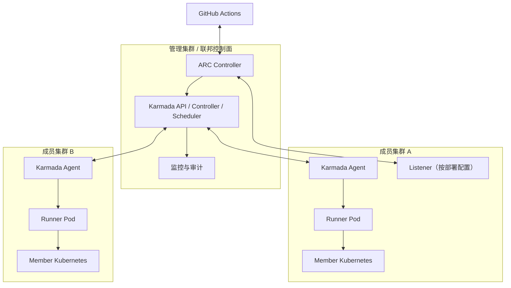
```mermaid
flowchart TB
  subgraph Control["管理集群 / 联邦控制面"]
    ARC["ARC Controller"]
    K["Karmada API / Controller / Scheduler"]
    OBS["监控与审计"]
  end
  subgraph A["成员集群 A"]
    KA["Karmada Agent"]
    LA["Listener（按部署配置）"]
    RA["Runner Pod"]
    NA["Member Kubernetes"]
  end
  subgraph B["成员集群 B"]
    KB["Karmada Agent"]
    RB["Runner Pod"]
    NB["Member Kubernetes"]
  end
  GH["GitHub Actions"] <--> ARC
  ARC <--> LA
  ARC --> K
  K <--> KA
  K <--> KB
  KA --> RA
  KB --> RB
  RA --> NA
  RB --> NB
  K --> OBS
```

图 3-4 ARC + Karmada 部署关系

说明：管理面通过 Karmada Agent 管理成员资源；成员集群保持本地 Pod 调度和执行自治。

成员集群数量、地域、设备类型和 Listener 部署位置由环境配置决定。成员之间不要求 Pod 网络互通；控制面通过 Karmada 成员连接管理资源传播。

### 3.6.1 安装与声明依赖次序

1. 注册并验证成员集群及 Karmada Agent 连接。
2. 部署 ARC Controller、Listener 和 RunnerScaleSet。
3. 配置 Listener 访问 Karmada API 所需的 TLS、身份和 RBAC。
4. 创建 PropagationPolicy、依赖传播配置和状态解释配置。
5. 验证 Runner Pod 在目标成员创建、注册、就绪、执行和回收。
6. 验证成员不可达、Secret 晚到、Pod 状态异常和删除滞后等故障路径。

## 3.7 官方依据与边界

- [ARC 工作原理](https://docs.github.com/en/actions/concepts/runners/actions-runner-controller)：GitHub Job 匹配、Listener 与 Runner 生命周期。
- [Karmada PropagationPolicy](https://karmada.io/docs/userguide/scheduling/propagation-policy/)：候选成员与传播策略。
- [Karmada 依赖传播](https://karmada.io/docs/userguide/scheduling/propagate-dependencies/)：资源依赖传播机制。
- [Karmada ResourceBinding API](https://karmada.io/docs/reference/karmada-api/work-resources/resource-binding-v1alpha2/)：放置结果与联邦资源关联。
- [Kubernetes Pod 生命周期](https://kubernetes.io/docs/concepts/workloads/pods/pod-lifecycle/)：成员 Pod 状态与生命周期。
- [Kubernetes Device Plugins](https://kubernetes.io/docs/concepts/extend-kubernetes/compute-storage-net/device-plugins/)：成员设备资源暴露与分配。

官方组件分别定义其 API 和控制器行为。本功能域描述 ARC 与 Karmada 的集成，不宣称存在上游联合控制器或跨集群事务。

## 4.1 功能域规格变更

本次功能域规格以 ARC + Karmada 联邦集成为边界。成员选择使用 Karmada 原生 Scheduler 和 PropagationPolicy；Runner 生命周期使用 ARC 原生控制器。未新增自定义调度控制器、联邦容量账本或成员级 NPU 准入对象。

| 规格 | 当前配置 | 目标约束 | 责任方 |
|---|---|---|---|
| Runner 入口 | ARC RunnerScaleSet | 用户通过统一 runs-on 标签选择 Runner 服务 | 平台 / ARC |
| 成员选择 | Karmada PropagationPolicy | 明确候选成员及资源匹配范围 | 平台 / Karmada |
| 依赖传播 | Karmada propagateDeps | 只传播 Runner Pod 引用的必要依赖 | 平台 / Karmada |
| Listener 访问 | Listener 使用受限身份访问 Karmada API | TLS、RBAC、Token 轮换可验证 | 平台运维 |
| 状态反馈 | Karmada 状态解释配置 | 状态字段完整、来源唯一且可追踪 | 平台 / Karmada |
| 成员执行环境 | 成员 Kubernetes | 成员标签与 Runner 镜像/运行环境兼容 | 资源供应方 |

## 4.2 SP-01 Runner 服务与任务入口规格设计

**场景：** vLLM 开发者提交 PR 时仍使用同一个 Runner 标签。无论实际运行在 vLLM 还是 vLLM-Omni 成员集群，工作流都不包含集群名称；标签与 Scale Set 名称的一致性由平台配置保证。

### 4.2.1 实现思路

工作流通过 `runs-on` 匹配 `AutoscalingRunnerSet.spec.runnerScaleSetName`。ARC 管理 Runner 生命周期（U）；平台维护服务、模板和候选成员的映射（D）。工作流无需成员名称；硬件或权限不兼容时，应分设服务。

### 4.2.2 实现设计

| 规范字段 | 类型/位置 | 约束 |
|---|---|---|
| 服务标识 | GitHub workflow `runs-on`、`AutoscalingRunnerSet.spec.runnerScaleSetName` | 同一个 Runner 服务在工作流 `runs-on` 与 `spec.runnerScaleSetName` 中必须使用相同名称。`karmada-runner` 是参考名称。 |
| GitHub 目标 | `spec.githubConfigUrl` | 平台管理员必须为 `spec.githubConfigUrl` 设置已授权的仓库或组织地址。Runner 不得注册到未授权的仓库或组织。 |
| 主凭证 | `spec.githubConfigSecret` | `spec.githubConfigSecret` 引用的凭证必须由可信管理域提供，并遵守 SP-04 的分发限制。 |
| 弹性区间 | `spec.minRunners/maxRunners` | `spec.minRunners` 与 `spec.maxRunners` 必须满足 `0 ≤ minRunners ≤ maxRunners`。具体数值由部署配置确定。 |
| Runner 镜像与 Pod 模板 | `spec.template` | `spec.template` 必须声明 Runner 镜像、资源请求、ServiceAccount 及必要的容器安全配置；镜像和资源请求须与候选成员的基础执行环境兼容。 |
| 版本约束 | ARC CRD/Controller/Listener/RunnerSet label | 部署方必须核对 ARC Controller、CRD 和 Runner 资源的版本兼容性。现有 0.15.0 只是配置示例。 |
| 成员能力标签 | Karmada Cluster labels | 成员标签应反映 Runner 镜像架构、运行时、网络和存储等必要条件；标签维护责任归成员运维。 |

标签无匹配时，不得替换服务；排队由 GitHub 处理。权限不足或容量已满时，保留错误及容量状态，不得绕过隔离。

## 4.3 SP-02/SP-03 Karmada 成员选择与依赖传播规格设计

### 4.3.1 实现思路

Runner Pod 由 ARC 创建并交由 Karmada 管理。Karmada Scheduler 根据 PropagationPolicy 中的资源选择器、成员范围和调度约束选择目标成员；Karmada Controller 创建 Work 并传播 Runner Pod。JIT Secret 等依赖通过 Karmada 依赖传播机制到达目标成员。

本规格只定义 ARC 与 Karmada 的联邦集成。成员选择使用 Karmada 原生调度机制，不增加独立调度控制器或自定义容量仲裁逻辑。

### 4.3.2 实现设计

| 项目 | 当前/目标设计 | 约束与异常处理 |
|---|---|---|
| 资源匹配 | PropagationPolicy ResourceSelector 匹配 ARC 创建的 Runner Pod | selector 范围必须精确；不得意外匹配其他工作负载 |
| 成员范围 | ClusterAffinity / ClusterAffinityLabelSelector 限定授权成员 | 候选成员为空时资源保持未放置并产生可诊断状态 |
| 成员选择 | Karmada Scheduler 根据策略和可获得的成员状态选择目标成员 | 不宣称 NPU 拓扑感知、跨成员容量预留或租户公平 |
| 资源传播 | Karmada Binding/Work 将 Runner Pod 传播至目标成员 | Work 创建不等于成员 Pod 已 Ready |
| 依赖传播 | propagateDeps 传播 Runner Pod 引用的 JIT Secret 等依赖 | 依赖可能异步到达；成员 Pod 在必需 Secret 可用前不能成功启动 |
| 状态回传 | Karmada 获取成员 Pod 状态并通过解释配置同步 | 保留必要的 conditions/containerStatuses；状态来源与目标 Pod 身份必须可关联 |
| 资源回收 | ARC 发起 Runner 生命周期回收，Karmada 清理传播对象 | 控制面删除与成员副本删除异步；成员失联时保留未知状态 |

### 4.3.3 成员选择与容量边界

Karmada 的成员选择基于其支持的调度字段、成员状态和传播策略。PropagationPolicy 的候选成员约束用于限定允许放置范围；它不构成业务级 NPU 容量准入契约。

成员内节点选择由目标成员 Kubernetes 调度器执行。NPU 扩展资源、节点拓扑、PodGroup/Gang 和 Device Plugin 的行为属于成员集群调度栈。本仓库不读取跨成员 NPU 容量账本，也不承诺按 NPU 卡数选择成员。

| 条件 | 本功能域行为 | 不提供的保证 |
|---|---|---|
| 成员满足策略约束且可调度 | Karmada Scheduler 按目标版本机制选择成员 | 不保证按业务租户公平或任务等待顺序 |
| 候选成员不满足策略约束 | 资源保持未放置，记录 Karmada 调度状态 | 不自动扩大成员授权范围 |
| 成员资源不足 | 成员调度器报告 Pod Pending / FailedScheduling 等状态 | 不跨成员拼接资源，不自动迁移运行中 Job |
| NPU Pod 无法在成员内调度 | 由成员调度栈处理节点、扩展资源和 Gang 条件 | 不由 ARC/Karmada 联邦层代替 Volcano 或 kube-scheduler |
| 成员暂时不可达 | Karmada 按成员状态与调度策略处理后续放置 | 不承诺正在执行的 Job 无损迁移或 exactly-once |

### 4.3.4 传播依赖与异步一致性

1. Runner Pod 的 Secret 引用必须与目标成员依赖传播规则一致。
2. Pod 和 Secret 的创建/传播是独立异步过程；Secret 未就绪时，Pod 启动失败或等待行为由 Kubernetes 和控制器实际机制决定。
3. 依赖传播失败必须通过 Karmada Work、成员事件和 Pod 状态定位，不得把 Work 已创建解释为依赖已就绪。
4. 同名 Secret 不代表内容版本一致；凭证轮换应核对控制面与成员副本。
5. Runner 删除后，ARC 与 Karmada 分别完成原生对象回收；残留对象通过 UID、Work 和成员上下文定位。

### 4.3.5 备选策略与取舍

| 策略 | 适用性 | 取舍 |
|---|---|---|
| 单一候选成员 | 固定执行集群或隔离场景 | 放置确定性高，但不能利用其他成员 |
| 多成员 ClusterAffinity | 允许 Runner 在多个成员执行 | 由 Karmada Scheduler 选择；结果遵循其版本和配置语义 |
| Divided / Weighted | 适用于具有副本语义且目标版本支持的资源 | 不用于声称多个独立 Runner Pod 按轮询或权重分配 |
| 自定义跨成员调度器 / 公平队列 | 属于独立的联邦调度产品能力 | 不在本仓库范围，不作为 ARC + Karmada 集成依赖 |

**设计结论：** 本仓库采用 PropagationPolicy 限定候选成员，由 Karmada Scheduler 选择 Runner Pod 的目标成员。策略字段及行为以仓库锁定的 Karmada CRD/API 版本为准。

### 4.3.6 关键接口与验证

| 接口/资源 | 操作主体 | 输入/输出 | 验证重点 |
|---|---|---|---|
| PropagationPolicy | 平台配置，Karmada 消费 | ResourceSelector、placement、propagateDeps | 只匹配目标 Runner Pod；候选成员范围符合授权 |
| ResourceBinding / Work | Karmada 控制器 | 源资源身份、目标成员、传播状态 | 目标成员唯一性、Work 与成员对象关联 |
| MemberCluster | Karmada / Agent | 成员注册、健康状态和标签 | 不健康成员不应被误判为正常候选 |
| Secret 依赖 | ARC 创建，Karmada 传播 | Pod Secret 引用与依赖对象 | 只传播所需 Secret；验证晚到、更新和删除 |
| Pod 状态解释 | Karmada 状态同步机制 | 成员 Pod status | 保留 ARC 需要的字段；不把空状态解释为 Ready |

### 4.3.7 故障与恢复

- **无候选成员：** 保留资源未放置状态，输出策略匹配和成员资格诊断；不扩大候选范围。
- **成员不可达：** 保留最后一次有效状态及观察时间；由 Karmada 原生成员健康和调度机制处理后续放置。
- **Work 创建失败：** 根据 Karmada 控制器状态重试；不得由 ARC 并行创建同一 Runner 的第二个独立执行对象。
- **依赖未传播：** 检查 Secret 引用、依赖传播规则和目标成员对象；不将 Pod 创建成功视为凭证可用。
- **成员 Pod Pending：** 以成员 Pod events、调度条件和资源请求定位原因；联邦层不伪造容量准入成功。
- **删除滞后：** 分别核对控制面源对象、Binding/Work 和成员副本；成员不可达时将清理状态标记为待确认。

## 4.4 SP-04/SP-05 身份、凭证与跨控制面访问规格设计

**场景：** Runner 被放置到 vLLM-Omni 集群后，需要临时 JIT 注册信息才能连接 GitHub，但不需要持有 ARC 的长期 GitHub 管理凭证。Listener 访问统一 Karmada API 时应使用独立的受限身份。跨成员共享计算资源不意味着跨成员共享管理权限。

### 4.4.1 实现思路

Controller、Listener、Runner 分别授权。Controller 管理 Runner 并持 GitHub 管理凭证；Listener 以最小权限访问 Karmada API；Runner 使用 JIT 注册配置，不持长期管理凭证。身份基于 ServiceAccount、TokenRequest、RBAC（U）；令牌签发、到期、轮换与审计由平台负责（D）。

### 4.4.2 实现设计

| 访问主体和目标 | 认证方式 | 规定的权限与安全限制 |
|---|---|---|
| Controller → Karmada API | Controller 必须通过可信 CA 验证 Karmada API，并使用专门的 Kubernetes API 凭证。 | 平台必须按 ARC 管理资源所需的 API 操作授予权限，不得把管理员级 kubeconfig 作为生产目标权限。 |
| Listener → Karmada API | Listener 必须使用单独的 ServiceAccount 凭证和可验证的 HTTPS 地址。 | 权限应限制为指定 Runner 服务需要的 `EphemeralRunnerSet` 与 `EphemeralRunner` 操作；当前 [RBAC Manifest](../manifests/03-rbac.yaml) 是配置示例。 |
| Runner Pod → GitHub Actions | Runner 使用 ARC 创建的 JIT 注册配置与 GitHub 通信。 | 不得使用管理端的长期 GitHub 凭证；Runner 模板使用 `automountServiceAccountToken: false` 避免自动挂载 Kubernetes API 令牌。 |
| Karmada → 成员 API | Karmada 使用联邦成员注册时配置的访问身份。 | 成员 API 凭证应限制在传播资源和读取必要状态的操作范围内，由平台身份管理者维护。 |

**部署方必须提供的认证参数（P）**：API 地址与端口、服务器证书名称、可信 CA、令牌的使用范围和有效期、凭证颁发者以及更新方法。平台必须规定 Listener 如何加载更新后的令牌或证书。仅修改 Kubernetes Secret 不能证明 Listener 一定会自动使用新凭证。

**异常**：DNS/TCP 失败记网络错误；证书链或名称不匹配记 TLS 错误；HTTP 401 记认证失败，403 记权限不足。保留类别；不得关闭 TLS 校验或授予 `cluster-admin`；日志不得含凭证原文。

### 4.4.3 身份权限与凭证传播矩阵

下表明确生产目标和**当前 Manifest 差异**；具体 `get/list/watch/create/update/patch/delete` 操作须按锁定版本 ARC Controller/Listener 的实际调用审计确定，不凭推测一次性赋予宽权限。

| 主体 → 目标 | 需要的身份及最小权限边界 | 凭证接收范围 | 当前配置事实/差距 |
|---|---|---|---|
| ARC Controller → Karmada API | 独立管理身份，仅允许管理所属 ARC 对象、Pod、JIT Secret 及所需状态；按真实 API 调用细化权限 | Controller 管理域 | `03-rbac.yaml` 注释注明宿主 Controller 使用 **admin kubeconfig**；不符合生产最小权限目标 |
| ARC Controller → GitHub | GitHub App 或受控管理凭证，只允许所授权的组织/仓库与 Runner 管理操作 | 实际管理消费者 | `04-autoscalingrunnerset.yaml` 引用 `arc-github-secret` |
| Listener → Karmada API | 独立 `karmada-listener-sa` 身份；限 `arc-runners` 目标资源，拒绝其他 Scale Set | 定向 Listener 成员；不得下发给普通 Runner | `03-rbac.yaml` 给 ERS 指定 `resourceNames: [karmada-runner]` 的 patch 权限；ER 的 get/patch/status patch 未按资源名约束，属当前版本所需最小能力待审查 |
| Runner → GitHub | ARC 生成的一次性 JIT 注册配置，不允许取得长期 GitHub 管理凭证 | **实际执行成员** | `04-autoscalingrunnerset.yaml` Runner 设置 `automountServiceAccountToken: false` |
| Runner → Kubernetes API | 默认不提供 Kubernetes API 身份，不自动挂载 SA Token | 无 | 配置已禁用自动挂载；仍须区分工作负载自身注入凭证的其他路径 |
| Karmada → 成员 Kubernetes API | 成员访问身份仅用于目标资源传播及状态读取 | 联邦控制器与目标成员 API | 成员凭证权限不在所列 Manifest 中定义，不宣称已经最小化 |
| Karmada → JIT Secret 成员副本 | 依据 Pod 引用及目标 Cluster 传播，**不等于加密或访问控制** | 执行该 Pod 的成员 | Runner Policy 开启 `propagateDeps: true`，需依赖上游版本的引用识别机制 |
| 平台 → GitHub 主 Secret | 长期凭证由指定管理端消费者使用，不应仅为 Runner 执行而向所有成员分发 | 仅实际消费者 | `02-propagation-policies.yaml` 当前向 member1/member2 **显式传播 `arc-github-secret`**；SP-04 目标未满足 |
| 平台 → Listener Karmada Token/CA | 控制面目标 audience、信任 CA 与可验证 SAN，限定具体 Listener 消费者 | 定向 member1（示例） | Listener Policy 显式选取 `karmada-token`，并启用 `propagateDeps`；`hostAliases` 和固定 API 端口为示例依赖 |

**最小权限判定原则**：RBAC `resourceNames` 仅对适用的操作和请求形式起约束作用，不能假定它限制任意 `list/watch` 或 `create`；细粒度鉴权需以 Kubernetes 原生规则与 ARC 实际请求验证。Runner 在隔离成员执行不代表无需控制面外的 GitHub 网络出站权限。

### 4.4.4 凭证发行、轮换、失效与撤销状态

| 凭证 | 发行与绑定 | 更新/轮换契约 | 撤销及故障处理 |
|---|---|---|---|
| GitHub 主凭证 | 由授权凭证方签发，限组织/仓库与应用权限；仅 Controller 等实际消费者读取 | 新旧凭证交叠时先确认消费者加载，再失效旧版本；不得向普通成员复制以解决注册失败 | GitHub 端吊销/失效及消费者替换分别确认；删除 Kubernetes Secret 副本不等于外部授权撤销 |
| Listener Karmada Token | 推荐 TokenRequest：限定 `audience`、`expirationSeconds`，核对目标 Karmada API 接受的颁发者与 audience | 在到期前更新并核实 Listener **重新读取** Token 与 CA；静态 Secret 挂载不等于原生自动续期；必要时按可控方式重启 Listener | 401/过期时停止成功声明，按身份/对象绑定/令牌有效期核查；RBAC 403 单独处理；不得降级为 admin kubeconfig |
| API TLS CA/证书 | 信任锚及服务端 SAN 与访问域名匹配 | 先引入新信任链并验证消费者切换，移除旧信任锚需确认所有消费者 | TLS 错误不得使用 insecure-skip-verify、绕过 SAN 或任意扩展 NO_PROXY 代替证书修复 |
| Runner JIT Secret | ARC 按临时 Runner 生成；受 Pod 引用及成员传播范围约束 | JIT 绑定单次 Runner；过期/不可用按 ARC 原生状态处理，不长期复用 | 结束后核查控制面与成员副本；是否还可在 GitHub 使用按上游机制判定，不把 Secret 删除等同远端即时撤销 |
| 成员 API 访问凭证 | Karmada/成员注册体系管理 | 证书/Token 替换期间需要区分成员连接失败和工作负载失败 | 凭证泄漏时收缩成员访问，保留 Work 清理未知状态以待恢复 |

**Kubernetes 官方机制边界**：投射的 ServiceAccount Token（TokenRequest + projected volume）在支持的 Pod 场景可由 kubelet 更新；但将 Token 放在由其他系统复制的**普通 Secret** 中，并不自动具备这种续期机制。TokenRequest 产生的 Token 还受过期时间、受众与对象绑定约束。应优先使用短期可轮换凭证；明确跨集群 API 对签发者和 audience 的验证。详见 [Kubernetes ServiceAccounts](https://kubernetes.io/docs/concepts/security/service-accounts/) 和 [Managing Service Accounts](https://kubernetes.io/docs/reference/access-authn-authz/service-accounts-admin/)。

**安全不变量**：

- SEC-01：Runner Pod 不获取 GitHub 主凭证或 Listener 控制面凭证；目标仅传播实际引用的 JIT。
- SEC-02：GitHub 主凭证仅向实际消费者授予；当前面向两个成员的传播是**已知差距**。
- SEC-03：Listener 只能操作经授权的 Runner 服务；当前 ER 资源宽度、Controller admin kubeconfig 必须作为生产权限缺口保留。
- SEC-04：轮换完成以**新凭证实际生效、旧凭证失效**两项事实为依据，不能仅以 Secret 更新成功判断。
- SEC-05：所有请求验证 TLS 链与 SAN；不得输出 Token/Secret 值到事件、日志、审计。
- SEC-06：成员失联时 Secret 副本存在性、删除及远端授权状态均记为未知，不伪造已撤销结论。

**配置差异：** 当前主凭证传播、Controller 高权限和 Listener Token 更新机制仍需满足上述安全约束。

## 4.5 SP-06/SP-07 状态与生命周期规格设计

### 4.5.1 实现思路

ARC、Karmada 和成员 Kubernetes 分别维护其负责对象的状态。跨控制面集成通过原生对象引用和状态同步形成可观察的 Runner 生命周期，不引入统一的跨系统事务状态机。

### 4.5.2 实现设计

| 状态对象 | 权威来源 | 消费者 | 状态边界 |
|---|---|---|---|
| GitHub Job | GitHub Actions | ARC / 用户 | Job queued、in_progress、completed 等由 GitHub 定义 |
| Runner CR | ARC Controller | ARC、Karmada 集成 | ERS/ER 的期望与生命周期由 ARC 调谐 |
| ResourceBinding / Work | Karmada | Karmada、运维 | 反映联邦放置与传播进度，不代表 Runner 注册成功 |
| 成员 Runner Pod | 成员 Kubernetes / kubelet | Karmada、ARC | Pod phase、conditions、containerStatuses 是成员执行事实 |
| Runner 注册状态 | GitHub Runner 服务 / ARC 可观测状态 | ARC | 不可仅由 Pod Ready 推断 |
| JIT Secret | ARC 创建，成员副本由传播机制维护 | Runner Pod | Secret 存在不等于 Runner 已成功注册 |

### 4.5.3 生命周期状态与不变量

| 阶段 | 主要事件 | 状态权威 | 必须保持的不变量 |
|---|---|---|---|
| DemandObserved | Listener 收到 Job Available | GitHub / ARC | 消息重复不应被解释为多个不同 Job |
| RunnerDesired | ARC 更新 ERS 期望数量 | ARC | 期望数量与实际 ER/Pod 数量允许短暂不一致 |
| RunnerCreated | ARC 创建 ER/Runner Pod | ARC | 每个对象使用 UID 关联；不以名称推断跨系统唯一性 |
| PlacementPending | Karmada 接收 Runner Pod 并等待调度 | Karmada | 未产生有效目标成员前不得认为成员 Pod 已创建 |
| WorkDispatched | Karmada 创建目标成员 Work | Karmada | Work 已分发不等于成员 Pod Ready |
| PodCreated | 成员 Kubernetes 创建 Pod | 成员 Kubernetes | 成员 Pod UID 与控制面源对象分别记录 |
| RunnerRegistered | Runner 与 GitHub 完成注册 | GitHub / ARC | Pod Ready 不替代 Runner 注册事实 |
| JobRunning / JobCompleted | Runner 执行 Job，GitHub 更新结果 | GitHub Actions | Job 终态以 GitHub 为准 |
| CleanupPending / Cleaned | ARC 删除 Runner，Karmada 清理传播对象 | ARC / Karmada / 成员 Kubernetes | 控制面删除成功不等于成员副本已删除 |

### 4.5.4 异步传播、冲突与恢复

1. **重复事件：** 按 API 对象 UID、Generation、ResourceVersion 和事件来源处理；不得仅凭名称合并对象。
2. **乱序事件：** 使用对象 UID 和当前 API 状态重新读取；旧事件不得覆盖更新后的状态。
3. **成员失联：** 保留最后观察状态和时间，标记状态未知；不得推断 Pod 已停止或资源已释放。
4. **控制面重启：** ARC/Karmada 控制器从持久化 API 对象恢复调谐，不依赖内存事件作为唯一事实。
5. **删除重试：** 对已删除对象的重复删除按 Kubernetes API 语义处理；成员副本清理状态单独核验。
6. **状态不完整：** 缺少必要 conditions/containerStatuses 时保持未知或未就绪，不合成 Ready。

### 4.5.5 状态聚合设计约束

Karmada ResourceInterpreterCustomization 必须针对锁定版本验证输入对象、状态字段提取和状态回传语义。解释器不得把空 statusItems、缺失条件或过期 Ready 映射为当前 Runner Ready。若目标版本无法提供唯一且新鲜的成员 Pod 状态，必须明确标记接口能力缺口，并由 ARC 可读取的原生状态或外部诊断补充；不得仅通过选择首个非空状态掩盖多来源冲突。

## 4.6 SP-08 成员执行环境与 NPU 资源边界

### 4.6.1 实现思路

本功能域负责将 ARC Runner Pod 传播到符合 PropagationPolicy 的成员集群。Runner 所执行的 NPU 工作负载使用成员集群已有的 Kubernetes、Volcano、Device Plugin 和驱动环境。

### 4.6.2 实现设计

- 成员集群必须具备运行 Runner 镜像所需的 CPU 架构、操作系统、容器运行时、网络和存储条件。
- NPU 工作负载的资源请求、设备型号、驱动/CANN 版本、节点拓扑和 Gang 约束由工作负载及成员资源池配置定义。
- 成员 kube-scheduler/Volcano 根据真实 Pod/PodGroup 请求进行节点调度；Device Plugin 向 kubelet 提供设备分配能力。
- Karmada 的成员选择不读取或仲裁跨成员 NPU 容量；Runner Pod 被放置到成员集群也不表示该成员一定有足够 NPU 资源运行后续工作负载。
- 本仓库不定义跨成员 NPU 容量账本、资源预留或成员级 NPU 准入 API。

### 4.6.3 运行约束与诊断

| 条件 | 责任组件 | 诊断依据 |
|---|---|---|
| Runner Pod 无法在成员节点启动 | 成员 Kubernetes | Pod events、节点条件、镜像拉取和挂载状态 |
| NPU Pod 资源不足 | 成员 kube-scheduler / Volcano | Pod Pending、FailedScheduling、PodGroup 状态 |
| 设备插件未就绪 | 成员 Device Plugin / kubelet | Node allocatable、插件日志和设备健康状态 |
| 驱动/CANN 不兼容 | 成员镜像与设备运行环境 | 节点镜像、驱动版本和工作负载启动日志 |
| 多机任务无法成组调度 | 成员 Volcano / 工作负载控制器 | PodGroup、Gang 状态和节点拓扑事件 |

以上属于成员执行环境约束，不构成本仓库的跨集群资源调度功能。

## 4.7 SP-09 跨功能质量与可服务性规格

### 4.7.1 关键路径与性能口径

端到端执行路径由 GitHub Job 匹配、ARC Runner 供给、Karmada 成员放置与传播、成员 Pod 启动、Runner 注册和 Job 执行组成。各阶段使用对应系统的权威时间戳；不将不同系统的排队时间合并成单一调度耗时。

| 阶段 | 起止事件 | 数据来源 |
|---|---|---|
| GitHub Job 等待 | queued → in_progress | GitHub Actions |
| Runner 供给 | Listener 收到 Job Available → Runner Pod 创建 | ARC / Kubernetes |
| 联邦放置 | Karmada 接收源 Pod → Binding/Work 指向目标成员 | Karmada |
| 成员启动 | Work 到达 → 成员 Pod Ready | Karmada / 成员 Kubernetes |
| Runner 注册 | Pod Ready → Runner 可领取 Job | ARC / GitHub |
| Job 执行 | Job in_progress → completed | GitHub Actions |

性能目标、样本量、分位数和统计窗口由业务确认；本功能域不承诺跨成员 NPU 利用率或公平性指标。

### 4.7.2 故障域、可用性与恢复约束

| 故障域 | 影响 | 设计响应 |
|---|---|---|
| GitHub API 不可用 | Job 匹配、Runner 注册或结果回传受影响 | ARC 按上游重试机制运行；记录外部依赖故障 |
| ARC Controller 不可用 | Runner 期望和生命周期调谐暂停 | 控制器恢复后从 API 对象继续调谐 |
| Karmada Control Plane 不可用 | 新资源放置和传播暂停，状态可能滞后 | 恢复后由 Karmada 控制器重新调谐 |
| 单个成员不可用 | 该成员 Pod 创建/状态反馈受影响 | Karmada 按成员状态和策略处理后续放置；不承诺运行中 Job 迁移 |
| 成员 Kubernetes 不可用 | 成员 Pod 创建、调度或状态更新受影响 | 成员恢复后继续调谐；保留状态未知区间 |
| Secret 传播异常 | Runner Pod 无法完成注册或启动 | 检查引用、传播状态和成员 Secret；不得暴露凭证内容 |

### 4.7.3 跨组件诊断契约

诊断链路至少关联 GitHub repository/run/job/attempt、RunnerScaleSet、EphemeralRunner UID、控制面 Pod UID、ResourceBinding/Work UID、目标 Cluster、成员 Pod UID。每个状态同时记录来源和观察时间。

诊断阶段包括 GitHub Job 等待、ARC Runner 创建、Karmada 放置、Work 传播、成员 Pod 创建/调度、Secret 可用、Runner 注册和 Job 执行。成员 NPU Pod Pending 属于成员工作负载调度问题，不应归因为 ARC Runner 联邦放置失败。

日志不得包含 GitHub 主凭证、Listener Token 或 JIT Secret Data。

### 4.7.4 DFX 场景—架构机制—设计验证矩阵

| 质量属性 | 场景 | 架构机制 | 验证准则 |
|---|---|---|---|
| 安全 | 未授权 Listener 访问 Karmada API | TLS、ServiceAccount、最小 RBAC | 未授权请求返回拒绝；授权操作限定资源范围 |
| 可靠性 | Karmada 或成员短暂不可用 | 上游控制器重试与持久化对象调谐 | 恢复后对象状态收敛；不产生重复 Runner |
| 可用性 | 单成员不可用 | PropagationPolicy 候选成员和 Karmada 成员状态 | 后续 Runner 遵循剩余候选成员策略；不承诺运行中 Job 迁移 |
| 可维护性 | ARC/Karmada 升级 | API/CRD 版本锁定、配置声明式管理 | 升级前核对字段兼容与回归用例 |
| 可服务性 | Runner 长时间未就绪 | Job、Runner、Binding、Work、成员 Pod 标识关联 | 能定位失败阶段和责任组件 |
| 数据保护 | JIT Secret 晚到或残留 | propagateDeps 与生命周期清理核验 | Secret 只传播到目标成员；回收后核对副本状态 |

# 5 功能实现设计

Kubernetes 资源接口遵循其 OpenAPI，ARC/Karmada 的自定义资源遵循目标版本 CRD。功能时序和接口表分别说明各组件之间的状态与操作契约。

### DFX 风险判定与设计验证规则

FMEA 按失效后果进行定性分级：**严重**＝长期管理凭证错误传播、越权修改联邦资源或错误确认执行；**高**＝任务中断、重复执行风险、凭证失效或资源清理无法确认；**中**＝局部排队、暂时 Pending、可恢复的单功能异常。等级依据影响和隔离能力判定；未经实际评估不填写故障概率或 RPN。恢复措施存在不意味着风险自动降低。

每条 FMEA 追加**设计措施 → 设计验证准则 → 剩余风险**。验证是通过设计文档/API 契约检查可判定的条件，不表示已运行测试或实际验证成功。**设计被接受**与**当前 Manifest 已满足**分别记录；涉及未落实的调度策略、权限或接口，必须标记差距。正式性能 SLO 和数据保留期不在此补写数值。

Kubernetes 关于 [RBAC 最小权限](https://kubernetes.io/docs/concepts/security/rbac-good-practices/)、[ServiceAccount](https://kubernetes.io/docs/concepts/security/service-accounts/) 及 Karmada [状态解释与聚合接口](https://karmada.io/docs/userguide/globalview/customizing-resource-interpreter/) 是风险控制的上游依据。

## 5.1 F-01 统一 Runner 服务入口

**典型场景：** vLLM 开发者只在 Workflow 中选择统一的 Runner 标签。平台在后台调整可执行成员，开发者不需要修改工作流。

### 5.1.1 功能概述

**关联的正式系统需求**：SR-01-01；**用例**：UC-01 通过统一标签提交工作流、UC-02 无匹配或无可用 Runner（异常处理，不单列 SR）；**功能域规格**：SP-01。

F-01 提供统一 Runner 服务名称。开发者通过 `runs-on` 选择服务，无需指定成员；平台配置服务、GitHub 目标与 Runner 模板。

**职责**：维护服务名称与 GitHub 目标映射；成员选择见 F-03，节点调度归 Kubernetes。

### 5.1.3 实现思路

`AutoscalingRunnerSet.spec.runnerScaleSetName` 必须与工作流 `runs-on` 一致。GitHub/ARC 负责匹配、创建和注册；不开发独立队列。硬件或权限不兼容时，分设 Runner 服务。

### 5.1.4 设计思路

GitHub 按 `runs-on` 匹配；Listener 接收需求，Controller 管理 Runner，F-03 选择成员。无匹配服务时，不得替换工作流标签或转交其他服务。

#### 5.1.4.1 UC-01 通过统一标签提交工作流——运行时序（US-01）

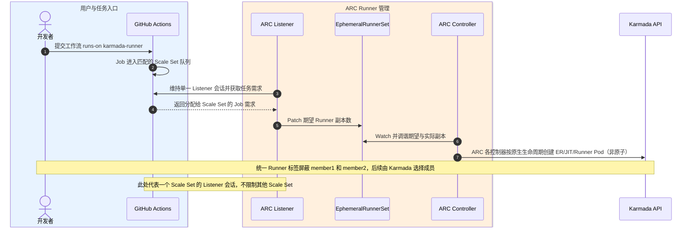
```mermaid
sequenceDiagram
    autonumber
    box rgb(232,243,255) 用户与任务入口
        actor Dev as 开发者
        participant GH as GitHub Actions
    end
    box rgb(255,240,222) ARC Runner 管理
        participant L as ARC Listener
        participant ERS as EphemeralRunnerSet
        participant C as ARC Controller
    end
    participant K as Karmada API

    Dev->>GH: 提交工作流 runs-on karmada-runner
    GH->>GH: Job 进入匹配的 Scale Set 队列
    L->>GH: 维持单一 Listener 会话并获取任务需求
    GH-->>L: 返回分配给 Scale Set 的 Job 需求
    L->>ERS: Patch 期望 Runner 副本数
    C->>ERS: Watch 并调谐期望与实际副本
    C->>K: ARC 各控制器按原生生命周期创建 ER/JIT/Runner Pod（非原子）
    Note over Dev,K: 统一 Runner 标签屏蔽 member1 和 member2，后续由 Karmada 选择成员
    Note over GH,L: 此处代表一个 Scale Set 的 Listener 会话，不限制其他 Scale Set
```

图 5-1-1 统一 Runner 服务提交主路径

说明：开发者继续使用统一 runs-on 标签，成员选择对工作流透明。

### 5.1.5 用户接口设计

通过 `jobs.<job>.runs-on` 选择服务，名称必须与 `spec.runnerScaleSetName` 一致。无独立 UI；复用 GitHub 和配置管理工具。

### 5.1.6 实现接口设计

#### 5.1.6.1 接口设计

| 交互双方 | 原生接口或资源 | 输入、操作与输出 | 权限与前置条件 | 异常处理与限制 | 依据及规格 |
|---|---|---|---|---|---|
| 工作流使用者与 GitHub Actions | GitHub Actions Workflow：`jobs.<job>.runs-on` | 开发者必须填写已发布的 Runner 服务名称。GitHub 根据该名称匹配 Runner。 | 开发者必须具有目标仓库工作流的提交权限。 | 名称未匹配时，GitHub 按其队列机制处理；平台不得改写标签。 | ARC-1；SP-01 |
| 平台配置与 ARC Controller | `AutoscalingRunnerSet`：`actions.github.com/v1alpha1` | 管理员必须配置服务名称、GitHub 目标、凭证引用、Runner 数量范围和 Pod 模板。 | Controller 必须具备所需的 Kubernetes API 与 GitHub 目标权限。 | API 拒绝创建或更新时，必须保留资源名称和错误原因；不能自行扩大权限。 | ARC-2；SP-01 |

**配置责任：** 平台维护 Runner Scale Set 模板及服务名称；Job 匹配和队列由 GitHub 管理。

### 5.1.9 DFX分析

**功能安全与性能约束**：Runner 的最大数量受 `maxRunners` 限制。平台必须防止 Runner 在未授权的 GitHub 仓库或组织中注册。具体并发容量和排队时间由业务方定义。

**可靠性故障分析（FMEA）**

| 编号 | 失效原因 | 业务或系统影响 | 检测方法 | 处理与恢复要求 | 负责方 |
|---|---|---|---|---|---|
| F01-01 | 工作流标签和 Runner 服务名称不一致。 | GitHub Job 不能匹配目标 Runner。 | 对照 `runs-on` 和 `runnerScaleSetName`，检查 GitHub Job 的排队信息。 | 平台管理员应修正不一致的服务配置，并检查修改影响。 | 平台维护者 |
| F01-02 | GitHub 管理凭证失效。 | Runner 无法正常向目标 GitHub 仓库注册。 | 检查 Controller 或 Listener 的认证错误和凭证引用。 | 身份管理者更新凭证；不得通过更改业务标签来规避认证失败。 | 身份管理员、ARC 运维 |

**风险—措施—验证追踪**（关联：SR-01-01、SR-NF-01/05；延续上方 FMEA 编号，不替代已有故障表）

| FMEA | 失效模式 | 影响 | 风险 | 设计措施及对应约束 | 设计验证准则 | 剩余风险 |
|---|---|---|---|---|---|---|
| F01-01 | 标签/服务配置不匹配 | Job 长时间无法获得 Runner | 中 | SP-01 保证服务标识一致；不进行隐式服务回退 | 对照 workflow/Scale Set 的匹配字段；未匹配时只能进入 GitHub 原生等待/错误路径 | 配置变更后仍可能出现短暂不匹配 |
| F01-02 | GitHub 管理凭证过期/授权错误 | Runner 无法注册，队列积压 | 高 | SP-04/SEC-02 凭证按消费者授予；轮换及 401 分类诊断 | 明确新凭证生效、旧凭证失效的判定；错误不以更换 runner 标签绕过 | 依赖 GitHub 可用性和有效授权 |

**运行诊断与敏感信息处理**：运维人员应先比较 `runs-on`、Runner Scale Set 名称和 GitHub 配置，再分析身份认证错误。审计不得记录 GitHub 管理凭证。

## 5.2 F-02 Runner 弹性供给及临时资源回收

**典型场景：** PR 高峰到来时，ARC 根据需求增减临时 Runner；任务结束后，Runner、关联 Pod 与 JIT 凭证逐步回收，避免空闲资源被长期占用。

### 5.2.1 功能概述

**关联需求**：SR-02-01、SR-02-02；**用例**：UC-03 Job 需求驱动 Runner 创建、UC-04 Job 结束回收 Runner 与凭证；**功能域规格**：SP-01、SP-06、SP-07。

F-02 按需供给临时 Runner。ARC 创建 Runner、Pod 和注册配置；作业结束后，ARC/Karmada 分别回收。通过对象 ID 关联同一任务。

**职责**：集成 Runner 需求与回收；注册协议及控制器沿用 ARC。

### 5.2.3 实现思路

复用 ARC `AutoscalingRunnerSet`、`EphemeralRunnerSet`、`EphemeralRunner` 生命周期。Karmada 传播并回收成员对象；不得新增争夺 Runner 所有权的控制器。临时资源按 UID/OwnerReference 关联，不依赖生成名称。

### 5.2.4 设计思路

Listener 更新 `EphemeralRunnerSet`，Controller 创建 Runner；成员启动 Pod 并注册 GitHub。作业结束后 ARC 回收 Runner，Karmada 异步删除传播对象。不要求同时删除，也不得因 Pod 失败重复派发 Job。

#### 5.2.4.1 UC-03 Job 需求驱动 Runner 创建——运行时序（US-02）

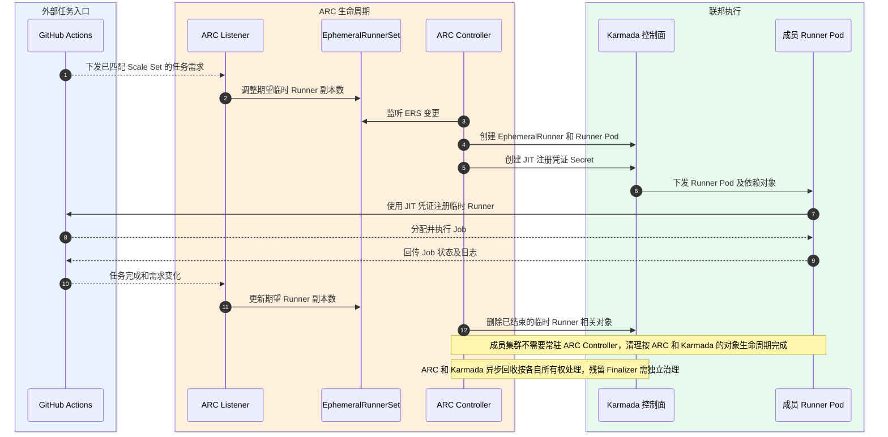
```mermaid
sequenceDiagram
    autonumber
    box rgb(232,243,255) 外部任务入口
        participant GH as GitHub Actions
    end
    box rgb(255,240,222) ARC 生命周期
        participant L as ARC Listener
        participant ERS as EphemeralRunnerSet
        participant C as ARC Controller
    end
    box rgb(231,249,239) 联邦执行
        participant K as Karmada 控制面
        participant Pod as 成员 Runner Pod
    end

    GH-->>L: 下发已匹配 Scale Set 的任务需求
    L->>ERS: 调整期望临时 Runner 副本数
    C->>ERS: 监听 ERS 变更
    C->>K: 创建 EphemeralRunner 和 Runner Pod
    C->>K: 创建 JIT 注册凭证 Secret
    K->>Pod: 下发 Runner Pod 及依赖对象
    Pod->>GH: 使用 JIT 凭证注册临时 Runner
    GH-->>Pod: 分配并执行 Job
    Pod-->>GH: 回传 Job 状态及日志
    GH-->>L: 任务完成和需求变化
    L->>ERS: 更新期望 Runner 副本数
    C->>K: 删除已结束的临时 Runner 相关对象
    Note over C,Pod: 成员集群不需要常驻 ARC Controller，清理按 ARC 和 Karmada 的对象生命周期完成
    Note over C,K: ARC 和 Karmada 异步回收按各自所有权处理，残留 Finalizer 需独立治理
```

图 5-2-1 Runner 弹性创建主路径

说明：GitHub/ARC 负责 Runner 供给，Karmada 在目标成员传播 Runner 对象。

#### 5.2.4.2 UC-04 Job 结束回收 Runner 与凭证——运行时序（US-07）

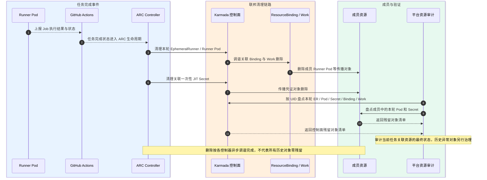
```mermaid
sequenceDiagram
    autonumber
    box rgb(232,243,255) 任务完成事件
        participant Pod as Runner Pod
        participant GH as GitHub Actions
        participant ARC as ARC Controller
    end
    box rgb(255,240,222) 联邦清理链路
        participant API as Karmada 控制面
        participant BW as ResourceBinding / Work
    end
    box rgb(231,249,239) 成员与验证
        participant Member as 成员资源
        participant Verify as 平台资源审计
    end

    Pod-->>GH: 上报 Job 执行结果与状态
    GH-->>ARC: 任务完成状态进入 ARC 生命周期
    ARC->>API: 清理本轮 EphemeralRunner / Runner Pod
    API->>BW: 调谐关联 Binding 与 Work 删除
    BW->>Member: 删除成员 Runner Pod 等传播对象
    ARC->>API: 清理关联一次性 JIT Secret
    API->>Member: 传播凭证对象删除
    Verify->>API: 按 UID 盘点本轮 ER / Pod / Secret / Binding / Work
    Verify->>Member: 盘点成员中的本轮 Pod 和 Secret
    Member-->>Verify: 返回残留对象清单
    API-->>Verify: 返回控制面残留对象清单
    Note over Verify: 审计当前任务关联资源的最终状态，历史异常对象另行治理
    Note over ARC,Member: 删除按各控制器异步调谐完成，不代表所有历史对象零残留
```

图 5-2-2 Runner 与临时依赖回收

说明：Job 结果、Pod 删除和凭证清理分别由相应权威组件确认。

#### 5.2.4.3 生命周期回收契约和异常时序

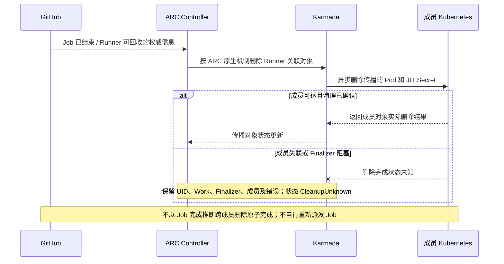
```mermaid
sequenceDiagram
  participant G as GitHub
  participant A as ARC Controller
  participant K as Karmada
  participant M as 成员 Kubernetes
  G-->>A: Job 已结束 / Runner 可回收的权威信息
  A->>K: 按 ARC 原生机制删除 Runner 关联对象
  K->>M: 异步删除传播的 Pod 和 JIT Secret
  alt 成员可达且清理已确认
    M-->>K: 返回成员对象实际删除结果
    K-->>A: 传播对象状态更新
  else 成员失联或 Finalizer 阻塞
    M--xK: 删除完成状态未知
    Note over K,A: 保留 UID、Work、Finalizer、成员及错误；状态 CleanupUnknown
  end
  Note over G,M: 不以 Job 完成推断跨成员删除原子完成；不自行重新派发 Job
```

图 5-2-3 Runner 生命周期异常恢复

说明：异常恢复不代表同一个 GitHub Job 可以安全重复执行。

| 触发 | 应核对的事实 | 恢复责任 |
|---|---|---|
| ER/Pod 创建后 JIT 未可用 | 成员 FailedMount、Pod 引用及 Karmada 依赖传播状态 | Karmada/成员继续原生调谐，ARC 按自身版本规则处理失败 |
| Pod Failed / Runner 注册失败 | ARC 原生 Runner 状态和 GitHub 是否已分配 Job | ARC/GitHub 的正式失败策略，不由集成层自创重投 |
| Job completed 后删除中 | ER、控制面 Pod、Binding/Work、成员 Pod、两侧 Secret | ARC 和 Karmada 分别负责自身对象；审计标记未确认项 |
| 删除被 Finalizer 阻塞 | deletionTimestamp、Finalizer 所属控制器与依赖 | 先修复原控制器或依赖，不直接删除未知 Finalizer |

**幂等性**：重复 Watch/Delete 通知只促使核对已有对象，不能生成另一份 Job；跨控制面清理非原子且顺序不固定。

### 5.2.5 用户接口设计

开发者通过 GitHub 查看作业状态；运维通过 Run、Runner、Pod、Work 标识排障。无需手动创建 Pod/Secret；无新增 UI。

### 5.2.6 实现接口设计

#### 5.2.6.1 接口设计

| 交互双方 | 原生接口或资源 | 输入、操作与输出 | 权限与前置条件 | 异常处理与限制 | 依据及规格 |
|---|---|---|---|---|---|
| ARC Listener 与 EphemeralRunnerSet | Kubernetes API：`EphemeralRunnerSet` 更新操作 | Listener 根据 GitHub 返回的任务需求更新指定 Runner 服务的期望数量。 | Listener 身份必须具有指定 Runner 服务所需的更新权限。 | API 返回资源版本冲突或拒绝访问时，必须保留失败原因，不得更新其他 Runner 服务。 | ARC-1；SP-01 |
| ARC Controller 与 Karmada API | `EphemeralRunner`、`Pod` 和 JIT Secret | ARC 创建临时 Runner 对象、Runner Pod 和注册所需的临时 Secret。 | Controller 必须有权管理所在命名空间的对应资源。 | 对象创建失败时记录资源类型和 API 错误，不得报告不存在的 Runner 已注册。 | ARC-1；SP-07 |
| ARC/Karmada 与成员 Kubernetes | Runner Pod、JIT Secret、`ResourceBinding`、`Work` | ARC 按官方生命周期删除临时 Runner，Karmada 调谐被传播对象的删除。 | 每个控制器只能依据其资源所有权处理相关对象。 | 删除未完成时保留对象 UID、Finalizer 和错误，不得清除未知 Finalizer。 | ARC-1、KAR-1；SP-07 |

**配置责任：** 平台维护 Runner Scale Set 及资源权限；ARC 管理动态 Runner 的创建和回收。

### 5.2.9 DFX分析

**功能安全与性能约束**：平台不能超过 Runner 服务规定的容量上限。作业失败后，未经确认的重复执行可能产生副作用，因此不得仅因 Runner Pod 消失而重新提交作业。JIT Secret 的数据不得写入日志。

**可靠性故障分析（FMEA）**

| 编号 | 失效原因 | 业务或系统影响 | 检测方法 | 处理与恢复要求 | 负责方 |
|---|---|---|---|---|---|
| F02-01 | ARC 对任务需求的响应延迟。 | GitHub Job 需要等待 Runner。 | 比较 Runner 的期望数量与实际数量，并检查 ARC Controller 事件。 | ARC 运维人员应检查控制器状态和资源容量；平台按业务阈值发出告警。 | ARC 运维 |
| F02-02 | Runner 注册失败或 Job 执行中断。 | Job 不能完成，错误重试可能导致重复执行。 | 检查 GitHub Run、临时 Runner 状态和 Pod 事件。 | 应按 GitHub 与 ARC 的官方机制处理；没有明确去重依据时不得再次派发。 | GitHub、ARC 运维 |
| F02-03 | 临时资源的 Finalizer 阻止删除。 | 临时 Pod 或 Secret 仍占用资源。 | 按对象 UID 检查 ER、Pod、Binding、Work 和 Secret 的删除状态。 | 由对象所属控制器完成清理；需要人工操作时先确认资源所有者。 | ARC、Karmada 运维 |

**风险—措施—验证追踪**（关联：SR-02-01、SR-02-02、SR-NF-03/06；延续上方 FMEA 编号，不替代已有故障表）

| FMEA | 失效模式 | 影响 | 风险 | 设计措施及对应约束 | 设计验证准则 | 剩余风险 |
|---|---|---|---|---|---|---|
| F02-01 | ARC 供给滞后或已达 maxRunners | Job 排队、服务容量不足 | 中 | SP-01 容量上下限；分离需求、实例和注册三个观测阶段 | 从 ERS 期望数、ER/Pod 数及 GitHub Job 状态能判断瓶颈位置；不得承诺未批准的 SLA | GitHub 与 ARC 响应延迟不可由本系统单方保证 |
| F02-02 | Runner 注册失败/运行中断 | Job 失败或重复执行副作用 | 高 | LC-01/LC-07 区分 Job 权威状态与 ARC 重试；集成层不自发重派 | Pod 丢失时不会由集成逻辑生成第二份相同 Job；结果取自 GitHub | 上游失败重试和业务幂等性仍需按正式机制约束 |
| F02-03 | Finalizer 或成员失联导致残留 | Pod/JIT Secret 持续存在，凭证暴露窗口增加 | 高 | LC-05 与 3.5.2 分域删除确认，CleanupUnknown 和按所有权清理 | 控制面删除后仍能报告未清成员对象、UID、Finalizer 与目标成员 | 失联期间不能保证立即销毁 |

**运行诊断与敏感信息处理**：使用 GitHub Run、临时 Runner、Runner Pod UID、JIT Secret 和 Binding/Work 追踪同一次任务。Finalizer 阻止删除时，必须先确认设置它的控制器。

## 5.3 F-03 Runner 联邦成员放置与依赖传播

### 5.3.1 功能概述

ARC 创建的 Runner Pod 需要在授权的成员 Kubernetes 集群运行。Karmada 根据 PropagationPolicy 选择目标成员，将 Runner Pod 及其必要依赖传播到成员，并同步成员 Pod 状态。

### 5.3.3 实现思路

使用 Karmada 原生 PropagationPolicy、ResourceBinding、Work 和依赖传播机制。平台负责维护精确的资源选择器、候选成员范围、依赖传播规则及状态解释配置。成员选择由 Karmada Scheduler 完成，不增加独立成员选择控制器。

### 5.3.4 设计思路

**UC-05 在授权成员放置 Runner——正常时序（US-03）**

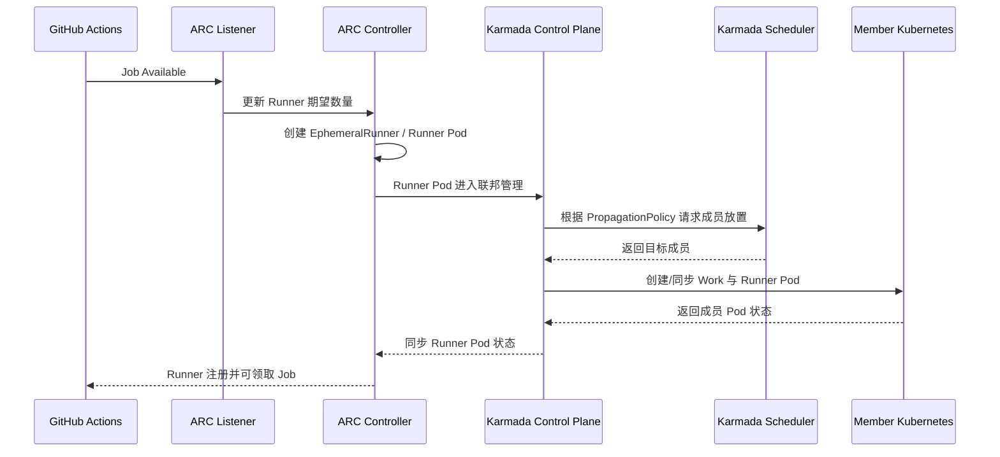
```mermaid
sequenceDiagram
    participant GH as GitHub Actions
    participant L as ARC Listener
    participant A as ARC Controller
    participant K as Karmada Control Plane
    participant S as Karmada Scheduler
    participant M as Member Kubernetes
    GH->>L: Job Available
    L->>A: 更新 Runner 期望数量
    A->>A: 创建 EphemeralRunner / Runner Pod
    A->>K: Runner Pod 进入联邦管理
    K->>S: 根据 PropagationPolicy 请求成员放置
    S-->>K: 返回目标成员
    K->>M: 创建/同步 Work 与 Runner Pod
    M-->>K: 返回成员 Pod 状态
    K-->>A: 同步 Runner Pod 状态
    A-->>GH: Runner 注册并可领取 Job
```

图 5-3-1 Karmada 选择成员并传播 Runner

说明：Karmada Scheduler 依据传播策略选择成员，Karmada Controller 负责 Work 传播。

**前置条件：** Runner Pod 匹配 PropagationPolicy；候选成员已注册且符合策略约束；ARC、Karmada 和成员 API 连通。

**后置条件：** Karmada 为 Runner Pod 建立目标成员放置并传播 Work；成员 Pod 创建后，ARC 根据可观察状态推进 Runner 生命周期。Work 已创建不代表 Runner 已注册。

**UC-06 JIT Secret 晚到——异常时序（US-04）**

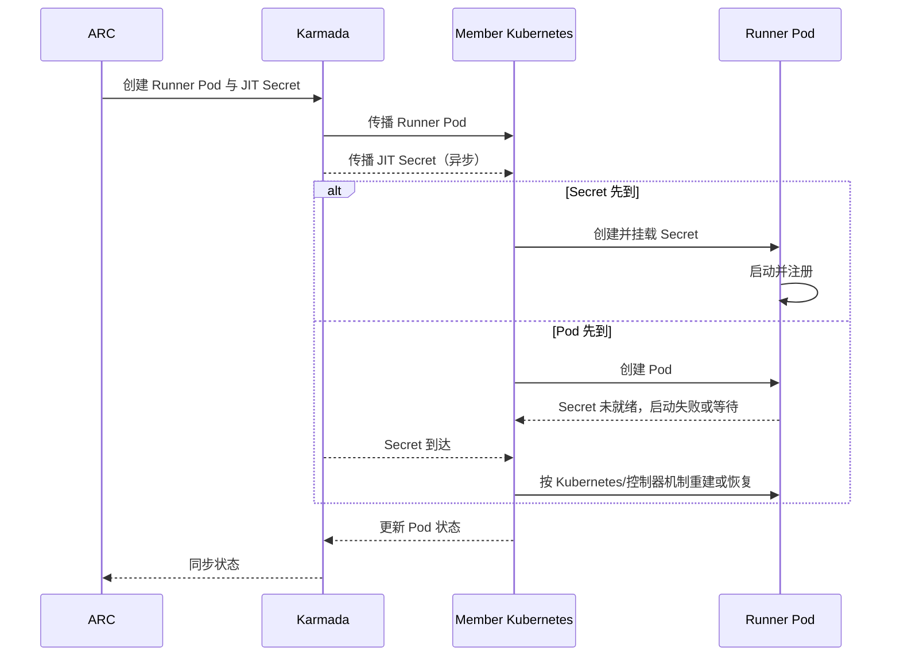
```mermaid
sequenceDiagram
    participant A as ARC
    participant K as Karmada
    participant M as Member Kubernetes
    participant R as Runner Pod
    A->>K: 创建 Runner Pod 与 JIT Secret
    K->>M: 传播 Runner Pod
    K-->>M: 传播 JIT Secret（异步）
    alt Secret 先到
        M->>R: 创建并挂载 Secret
        R->>R: 启动并注册
    else Pod 先到
        M->>R: 创建 Pod
        R-->>M: Secret 未就绪，启动失败或等待
        K-->>M: Secret 到达
        M->>R: 按 Kubernetes/控制器机制重建或恢复
    end
    M-->>K: 更新 Pod 状态
    K-->>A: 同步状态
```

图 5-3-2 JIT Secret 依赖异步传播

说明：Runner Pod 与 JIT Secret 分别传播；Secret 未就绪时 Runner 不得判为可执行。

**约束：** Pod 和 Secret 传播是异步的。具体晚到后的恢复行为取决于 Pod 启动状态和上游控制器重试机制；不得假设容器会在 Secret 后到后自动恢复运行。

**UC-10 成员不可用——异常处理**

| 故障 | 系统行为 | 诊断依据 |
|---|---|---|
| 候选成员均不满足策略 | Runner Pod 保持未放置 | PropagationPolicy、Binding 状态、成员资格 |
| 目标成员失联 | Work/成员 Pod 状态可能滞后 | MemberCluster 状态、Agent 连接、最后观察时间 |
| Work 传播失败 | Karmada 控制器按原生机制重试 | Work 状态、控制器日志和事件 |
| 成员 Pod Pending | 由成员 Kubernetes 调度和事件说明原因 | Pod conditions、FailedScheduling、Node 状态 |
| 运行中成员失联 | Job 终态可能暂时未知 | GitHub Job、Runner、成员 Pod 最后状态 |

本功能域不复制 Runner、不重派 GitHub Job，也不承诺运行中 Job 无损迁移。

### 5.3.5 用户接口设计

用户只使用平台公布的 runs-on 标签。用户不指定成员集群、ResourceBinding、Work 或 Secret 传播策略。

### 5.3.6 实现接口设计

#### 5.3.6.1 接口设计

| 交互双方 | API / 资源 | 操作与输入输出 | 权限与约束 | 失败处理 |
|---|---|---|---|---|
| 平台配置 → Karmada | PropagationPolicy | 选择 Runner Pod 并定义成员范围 | 仅平台配置身份可修改 | 配置无效时不扩大候选成员 |
| Karmada Scheduler | ResourceBinding | 记录源资源与目标成员放置 | 使用 Karmada 原生控制器权限 | 保留调度失败状态 |
| Karmada Controller → Member | Work | 在目标成员传播 Runner Pod | 由 Karmada Agent 执行 | Work 状态与成员 Pod 分开诊断 |
| Karmada 依赖传播 | propagateDeps | 传播 Pod 引用的 JIT Secret | 只传播必要依赖 | 核对目标成员 Secret 是否存在 |
| Member Kubernetes → Karmada | Pod.status | 回传成员 Pod 状态 | 状态身份必须关联源对象和目标成员 | 旧 UID/过期状态不得覆盖当前状态 |

### 5.3.7 放置正确性约束

1. 一个 Runner Pod 的有效目标成员由 Karmada Binding 记录；不得通过同名对象推断目标成员。
2. PropagationPolicy 的资源选择器必须精确匹配 Runner Pod。
3. 候选成员范围必须显式配置；成员标签变化须纳入配置变更审查。
4. 不把 Divided/Weighted 的副本分配语义解释为独立 Runner Pod 的轮询或公平调度。
5. Karmada 负责成员选择；成员 Kubernetes 负责节点选择。
6. 成员 NPU 资源不足属于成员内工作负载调度问题，不触发联邦层跨成员卡数拼接。
7. 删除和重建必须依据 ARC/Karmada 原生对象 UID 与所有权关系，不以名称复用旧执行身份。

### 5.3.9 DFX分析

**FMEA：**

**关键不变量：** Runner Pod 只在策略允许的成员执行；JIT Secret 只传播到实际需要的成员；成员状态必须保留来源和对象身份；Karmada 放置结果不等于成员 Pod Ready。

| 编号 | 失效模式 | 影响 | 检测方法 | 设计措施 | 验证准则 |
|---|---|---|---|---|---|
| F03-01 | PropagationPolicy selector 过宽 | 非 Runner 工作负载被传播 | 检查 selector 与被匹配对象 | 精确限定 API group/kind/namespace/labels | 非目标对象不生成 Binding/Work |
| F03-02 | 候选成员标签错误 | Runner 放置到不兼容成员 | 对照 Cluster labels 和成员清单 | 成员标签变更纳入审查和巡检 | 不满足条件的成员不进入候选范围 |
| F03-03 | 成员失联或状态过期 | 放置结果和成员 Pod 状态不可确认 | MemberCluster、Agent、Work 和最后观察时间 | 标记状态未知，保留故障证据 | 不把失联解释为 Pod 已删除或资源已释放 |
| F03-04 | JIT Secret 未传播 | Runner 无法注册或启动 | Secret 引用、Work、成员 Secret 和 Pod events | 校验 propagateDeps 与目标成员 | Secret 未就绪时 Runner 不报告为 Ready |
| F03-05 | Pod 与 Secret 到达顺序不同 | Runner 启动失败或延迟 | 成员 Pod events、Secret 创建时间 | 明确异步依赖和重试边界 | 验证 Secret 晚到时的真实恢复行为 |
| F03-06 | Work 已创建但成员 Pod 未创建 | Runner 长时间未就绪 | Work 状态、成员 API、Pod events | 分开呈现 Work 和 Pod 状态 | 能定位传播失败与成员创建失败 |
| F03-07 | 多个独立 Runner Pod 被误认为均匀分配 | 成员分布不符合预期 | 对照各 Pod Binding 目标成员 | 只按 Karmada 目标版本调度语义描述 | 不把 Weighted/Divided 解释为独立 Pod 轮询 |
| F03-08 | 删除源对象后成员副本残留 | 临时资源或凭证残留 | 源 Pod、Binding、Work、成员 Pod/Secret UID | 按 Karmada 原生删除调谐并核验成员副本 | 成员恢复连接后残留对象可被识别和清理 |
| F03-09 | 运行中成员失联 | Job 结果和 Runner 状态未知 | GitHub Job、Runner 和成员最后状态 | 保留 ExecutionUnknown，不创建重复 Runner | 不因状态未知自动复制或重派 Job |

**风险验证：** 对无候选成员、成员失联、Secret 晚到、Work 传播失败、Pod Pending 和删除滞后分别执行设计验证。验证以 Karmada/ARC 锁定版本的 API 行为为准，不把未实现的容量准入、公平队列或故障迁移纳入验收。

## 5.4 F-04 Listener 跨控制面认证与访问

**典型场景：** Listener 在成员集群运行，却要修改统一 Karmada 控制面内的 Runner 期望状态。身份或证书配置失效会导致 Runner 无法按 Job 需求扩容。

### 5.4.1 功能概述

**关联需求**：SR-04-01；**用例**：UC-08 Listener 访问统一 Karmada API、UC-11 Token 失效或证书不匹配；**功能域规格**：SP-04、SP-05。

F-04 为成员 Listener 提供 Karmada API 地址、可信证书和最小授权身份，仅允许操作所属 Runner 服务。

**职责**：Listener 访问身份、地址和权限；不修改 API Server 认证。

### 5.4.3 实现思路

用 ServiceAccount、TokenRequest 和 RBAC 建立 Listener 身份。校验 Karmada API 证书链与名称。地址、CA、Token 由部署提供；示例固定 IP 和签发脚本不等于自动轮换。

### 5.4.4 设计思路

凭证方签发 Token/CA；Listener 验证服务器证书，API Server 校验身份与权限。校验通过才能更新指定 `EphemeralRunnerSet`；网络、TLS、401、403 分别记录。

#### 5.4.4.1 UC-08 Listener 访问统一 Karmada API——运行时序（US-05）

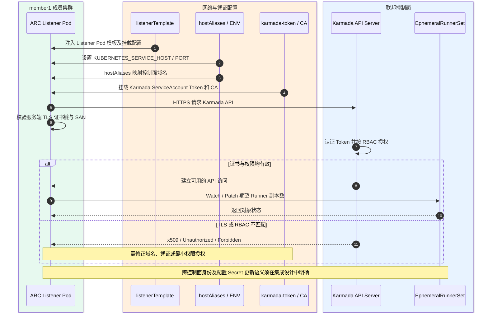
```mermaid
sequenceDiagram
    autonumber
    box rgb(231,249,239) member1 成员集群
        participant L as ARC Listener Pod
    end
    box rgb(255,240,222) 网络与凭证配置
        participant T as listenerTemplate
        participant N as hostAliases / ENV
        participant SA as karmada-token / CA
    end
    box rgb(232,243,255) 联邦控制面
        participant API as Karmada API Server
        participant ERS as EphemeralRunnerSet
    end

    T->>L: 注入 Listener Pod 模板及挂载配置
    N->>L: 设置 KUBERNETES_SERVICE_HOST / PORT
    N->>L: hostAliases 映射控制面域名
    SA->>L: 挂载 Karmada ServiceAccount Token 和 CA
    L->>API: HTTPS 请求 Karmada API
    L->>L: 校验服务端 TLS 证书链与 SAN
    API->>API: 认证 Token 并按 RBAC 授权
    alt 证书与权限均有效
        API-->>L: 建立可用的 API 访问
        L->>ERS: Watch / Patch 期望 Runner 副本数
        ERS-->>L: 返回对象状态
    else TLS 或 RBAC 不匹配
        API-->>L: x509 / Unauthorized / Forbidden
        Note over L,SA: 需修正域名、凭证或最小权限授权
    end
    Note over L,ERS: 跨控制面身份及配置 Secret 更新语义须在集成设计中明确
```

图 5-4-1 Listener 跨控制面访问

说明：TLS、认证、RBAC 权限各有明确控制面与错误归属。

#### 5.4.4.2 UC-11 令牌轮换、权限拒绝和撤销——异常时序

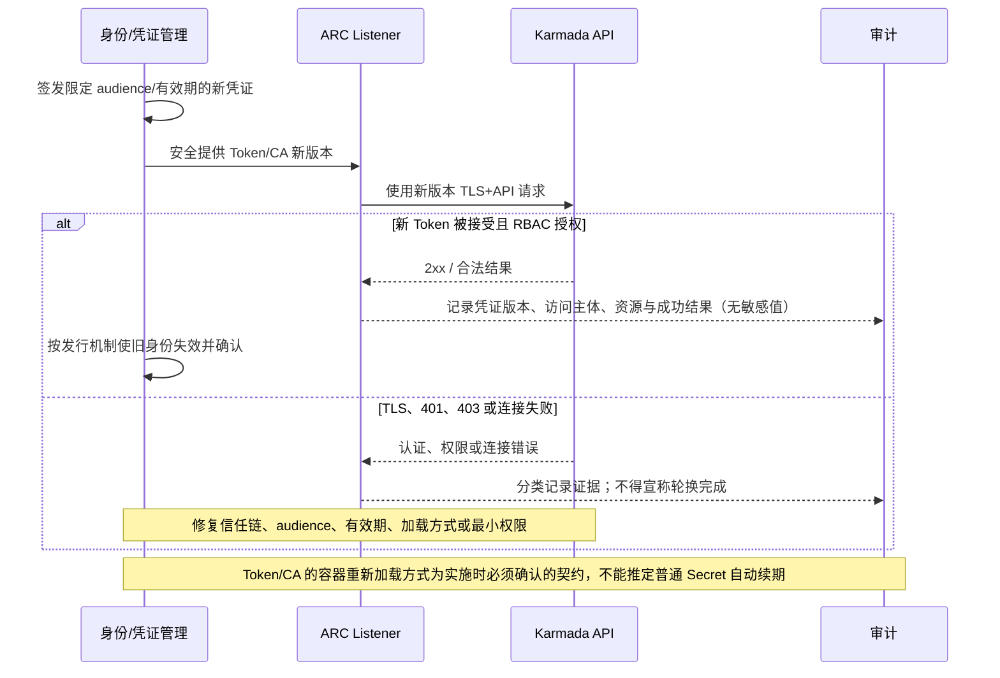
```mermaid
sequenceDiagram
  participant I as 身份/凭证管理
  participant L as ARC Listener
  participant K as Karmada API
  participant A as 审计
  I->>I: 签发限定 audience/有效期的新凭证
  I->>L: 安全提供 Token/CA 新版本
  L->>K: 使用新版本 TLS+API 请求
  alt 新 Token 被接受且 RBAC 授权
    K-->>L: 2xx / 合法结果
    L-->>A: 记录凭证版本、访问主体、资源与成功结果（无敏感值）
    I->>I: 按发行机制使旧身份失效并确认
  else TLS、401、403 或连接失败
    K-->>L: 认证、权限或连接错误
    L-->>A: 分类记录证据；不得宣称轮换完成
    Note over I,K: 修复信任链、audience、有效期、加载方式或最小权限
  end
  Note over I,A: Token/CA 的容器重新加载方式为实施时必须确认的契约，不能推定普通 Secret 自动续期
```

图 5-4-2 控制面访问及凭证异常恢复

说明：区分网络、证书、认证、授权和凭证撤销。

| 情况 | 错误归属 | 设计恢复动作 | 禁止行为 |
|---|---|---|---|
| DNS/TCP/路由失败 | 网络连通性 | 恢复控制面可达，保留目标地址和错误分类 | 不转向未经验证 API |
| TLS CA/SAN 不匹配 | 服务端身份与信任链 | 修正证书链、访问域名、信任锚 | 不关闭 TLS 校验 |
| HTTP 401 | Token 到期、issuer/audience、对象绑定或载入失败 | 重新核对 Token 有效性、消费者加载和 Karmada 认证配置 | 不升级为管理员凭证 |
| HTTP 403 | RBAC 不足或请求作用域不匹配 | 对照实际 API verb、resource、namespace 与 `resourceNames` | 不直接授予 cluster-admin |
| Secret 副本留存/成员失联 | 传播与回收状态未知 | 记录目标成员及副本 UID；恢复后核对，并独立检查远端凭证撤销 | 不宣称删除控制面 Secret 即完成全域撤销 |
| 更新 Secret 但 Listener 仍用旧 Token | 凭证加载机制 | 定义可检查的新凭证加载/Listener 重启流程 | 不把 Secret resourceVersion 变化当成轮换成功 |

**接口审计：** 记录调用身份、目标资源与操作、请求结果、失败类别、非敏感凭证版本及观测时间。`03-rbac.yaml` 中的 `ephemeralrunners` 权限以及 Controller 的管理员 kubeconfig 仍需收敛到最小授权。

### 5.4.5 用户接口设计

身份和轮换由安全管理员维护；运维查看 Listener 状态、错误类型及证书/Token 版本。复用现有工具，无独立 UI。

### 5.4.6 实现接口设计

#### 5.4.6.1 接口设计

| 交互双方 | 原生接口或资源 | 输入、操作与输出 | 权限与前置条件 | 异常处理与限制 | 依据及规格 |
|---|---|---|---|---|---|
| ARC Listener 与 Karmada API | HTTPS Kubernetes API、`EphemeralRunnerSet` | Listener 必须使用指定 API 地址、可信 CA 和访问令牌更新所负责的 Runner 对象。 | Token 必须来自受控身份；RBAC 只授予所需对象和操作。 | 网络、证书、HTTP 401、HTTP 403 和超时必须分别记录，不允许绕过认证。 | K8S-1、K8S-2；SP-05 |
| 部署与密钥管理系统和 Listener Pod | Listener 模板、Secret 或受控凭证投射卷 | 部署方必须提供 CA、Token、有效期及 API 连接信息，并明确更新后的加载方式。 | 凭证应以只读方式提供给需要的容器，禁止出现在日志中。 | Token 到期或未加载时，必须报告身份状态；不得假定修改 Secret 后立即生效。 | SP-04、SP-05 |
| 安全管理员与 Kubernetes RBAC | `Role`、`RoleBinding` | 对指定 `EphemeralRunnerSet` 授予所需 `patch` 权限，对必要的 `EphemeralRunner` 资源授予对应读写和状态权限。 | 必须确认 ServiceAccount 命名空间、绑定对象以及操作范围。 | RBAC 配置与契约不一致时，应修正 Role/Binding；不得赋予 `cluster-admin`。 | K8S-2；SP-05 |

**配置责任：** 身份管理方负责 ServiceAccount、RBAC、Listener 访问地址、证书和 Token 更新机制。

### 5.4.9 DFX分析

**功能安全与性能约束**：Listener 必须验证 HTTPS 服务器证书。凭证只授予必要操作权限，日志不得包含 Token 或私钥。高可用与不中断轮换属于部署参数，不能宣称已自动具备。

**可靠性故障分析（FMEA）**

| 编号 | 失效原因 | 业务或系统影响 | 检测方法 | 处理与恢复要求 | 负责方 |
|---|---|---|---|---|---|
| F04-01 | API 地址不可达或 TLS 证书校验失败。 | Listener 不能访问 Karmada API。 | 分别检查 DNS/TCP 连通性、CA 与证书 SAN。 | 部署维护者应修正服务地址或证书配置，不能关闭 TLS 校验。 | 部署与证书管理员 |
| F04-02 | Token 已到期或 Listener 未加载新 Token。 | Listener 的 Runner 数量更新操作失败。 | 检查 HTTP 401、Token 有效期和凭证加载记录。 | 身份管理员更新 Token；部署维护者按规定重载 Listener。 | 身份与部署维护者 |
| F04-03 | Role 或 RoleBinding 的授权范围错误。 | Listener 无法操作所需资源，或存在越权风险。 | 检查 HTTP 403 与 Role/Binding 中的资源名称及操作。 | 安全管理员按最小权限规则修正配置，保留变更审计。 | 安全管理员 |

**风险—措施—验证追踪**（关联：SR-04-01、SR-NF-01/02；延续上方 FMEA 编号，不替代已有故障表）

| FMEA | 失效模式 | 影响 | 风险 | 设计措施及对应约束 | 设计验证准则 | 剩余风险 |
|---|---|---|---|---|---|---|
| F04-01 | TLS 身份校验错误或连接不可达 | Listener 无法安全访问控制面 | 高 | SP-05 强制 CA/SAN 校验，网络/TLS 分别诊断 | 错误路径不允许 insecure-skip-verify、换用未知地址或管理员凭证 | 证书与网络基础设施失效仍影响供给 |
| F04-02 | Token 到期、新凭证未被加载 | ERS 更新失败、Runner 供给停止 | 高 | SEC-04 轮换双确认；按加载机制更新或安全重启 | Secret 更新但旧 Token 仍在使用不得判为轮换成功；401 可追踪 | 需要目标运行方式的加载/轮换能力 |
| F04-03 | RBAC 过大或过小 | 越权修改/合法操作被拒绝 | 严重 | SEC-03 逐 API verb/resource/namespace 收敛；Controller 禁止生产 admin kubeconfig | 授权身份只可改所属资源；403 单独报告；当前 admin kubeconfig 标记为差距 | 上游版本变更可能改变所需权限 |
| F04-04 | GitHub 主凭证被传播至无消费者成员 | 成员被攻陷后获取长期管理凭证 | 严重 | SEC-01/02 分离管理凭证、JIT 和 Listener 身份；只允许实际消费者读取与传播 | 核对 PropagationPolicy：非消费者成员无长期主 Secret；当前双成员分发标记未满足 | 凭证本身受外部授权与撤销机制限制 |

**运行诊断与敏感信息处理**：平台必须分开记录网络连接错误、证书校验错误、HTTP 401 与 HTTP 403。出现权限失败时，不能通过关闭 TLS 或授予 `cluster-admin` 来绕过。

## 5.5 F-05 Runner Pod 状态反馈与一致性

**典型场景：** Runner 在远端成员已经启动，但管理面仍显示 Pending；或者成员失联而管理面保留旧 Ready。状态解释必须区分真实成员状态与缓存、过期或冲突状态。

### 5.5.1 功能概述

**关联需求**：SR-05-01；**用例**：UC-09 Runner Ready 状态反馈、UC-12 状态缺失、冲突或滞后；**功能域规格**：SP-06、SP-07。

F-05 将成员 Pod 状态回传 Karmada，供 ARC 读取容器名、运行状态与 Ready；仅支持单执行成员。

**职责**：状态解释及来源约束；Job 结果归 GitHub。

### 5.5.3 实现思路

用 Karmada `ResourceInterpreterCustomization` 保留 Pod 状态，不改 ARC/Karmada 控制器。多来源状态须另定冲突规则，不能直接取第一个非空值。

### 5.5.4 设计思路

成员 kubelet 更新 Pod，Karmada 汇总状态，ARC 读取 Ready 和容器信息。目标状态适配契约必须核对当前 Binding/Work 的唯一目标成员和 Pod 身份后，才允许 ARC 所读对象呈现有效 Ready；来源缺失或过期时不得保留先前 Ready 作为可执行证据。此处是目标设计，不表示当前 Lua 已能读取所需全部上下文。

#### 5.5.4.1 UC-09 Runner Ready 状态反馈——运行时序（US-06）

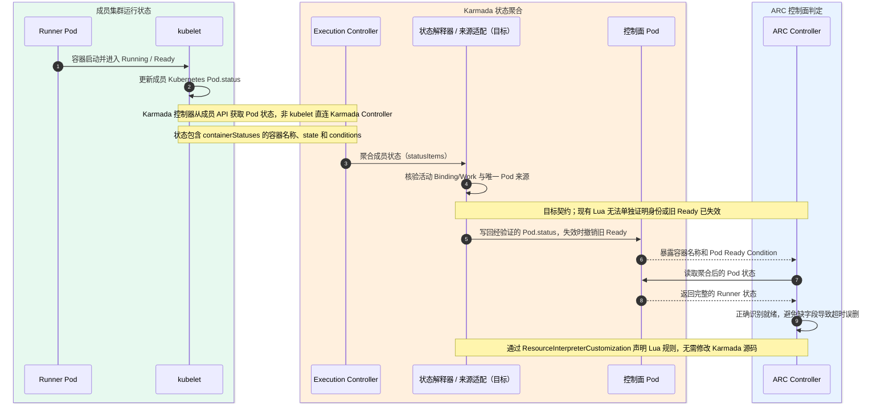
```mermaid
sequenceDiagram
    autonumber
    box rgb(231,249,239) 成员集群运行状态
        participant Pod as Runner Pod
        participant Kubelet as kubelet
    end
    box rgb(255,240,222) Karmada 状态聚合
        participant EC as Execution Controller
        participant RI as 状态解释器 / 来源适配（目标）
        participant CP as 控制面 Pod
    end
    box rgb(232,243,255) ARC 控制面判定
        participant ARC as ARC Controller
    end

    Pod->>Kubelet: 容器启动并进入 Running / Ready
    Kubelet->>Kubelet: 更新成员 Kubernetes Pod.status
    Note over Kubelet,EC: Karmada 控制器从成员 API 获取 Pod 状态，非 kubelet 直连 Karmada Controller
    Note over Kubelet,EC: 状态包含 containerStatuses 的容器名称、state 和 conditions
    EC->>RI: 聚合成员状态（statusItems）
    RI->>RI: 核验活动 Binding/Work 与唯一 Pod 来源
    Note over RI,ARC: 目标契约；现有 Lua 无法单独证明身份或旧 Ready 已失效
    RI->>CP: 写回经验证的 Pod.status，失效时撤销旧 Ready
    CP-->>ARC: 暴露容器名称和 Pod Ready Condition
    ARC->>CP: 读取聚合后的 Pod 状态
    CP-->>ARC: 返回完整的 Runner 状态
    ARC->>ARC: 正确识别就绪，避免缺字段导致超时误删
    Note over RI,ARC: 通过 ResourceInterpreterCustomization 声明 Lua 规则，无需修改 Karmada 源码
```

图 5-5-1 成员 Pod 状态反馈到 ARC

说明：旧 Ready 不一定代表当前成员可执行，冲突要回到权威来源核对。

##### 5.5.4.2 多来源状态聚合及过期状态处理

**当前配置差距**：`manifests/01-karmada-interpreter.yaml` 中的 `AggregateStatus` 使用第一个非空 `statusItems[i].status`，只在确实存在唯一可信来源时才适用，**没有实现**按目标成员选择、冲突隔离或过期识别。特别是 `statusItems` 为空时该 Lua 返回未修改的 `desiredObj`，可能留下旧 Ready；不能以`#statusItems == 1` 代替当前 Binding、Pod UID 与状态新鲜度校验。

| 输入/条件 | 设计要求 | 不满足时 |
|---|---|---|
| ResourceBinding/Work 的当前活动目标 Cluster | 聚合源只能来自目标成员 | 无法唯一确认时不产生新的 Ready 结论 |
| 成员 Pod 身份（Cluster、namespace、name、UID） | 来源与当前传播实例匹配，不使用旧 Pod/旧 Work 的状态 | 记为 Unknown 并保留冲突证据 |
| Pod phase、conditions、containerStatuses | 保留 ARC 目标版本实际需要的全部状态字段 | 不合成缺失字段或假造 Ready |
| 最新性 | 在同一对象/集群内使用 UID 和实际可比较的版本/观测时间；跨集群不比较 resourceVersion | 信息不全则保留未确认状态 |
| 空状态/成员失联 | 必须使 ARC 实际读取路径不再将旧 `Pod Ready=True` 当作当前 Ready；保留 StatusUnknown 和证据 | 不能直接返回旧 `desiredObj.status` 并声称安全 |
| 状态恢复 | 重新核对唯一目标成员、当前 Pod UID、来源最新性以及 ARC 可读状态 | 未完成校验不得仅凭原有 Ready 恢复 |

**扩展点与读状态路径**：目标版本 `ResourceInterpreterCustomization` 是否暴露目标 Cluster 和 Pod UID，以及 Lua 是否能查询当前 Binding/Work，必须由该版本接口确认。若缺少这些输入，状态选择必须由能取得 Binding/Work 和成员 Pod 身份的受控适配机制完成，并明确何处阻止旧 Ready 进入 ARC 可读的 Pod 状态。**仅增加监控侧 StatusUnknown 不满足 LC-08**；若目标版本没有可实施的读状态保护路径，应保留阻塞项，不把“无旧 Ready 误判”列为已兑现能力。

**正确性出口**：成员状态、控制面聚合状态和 GitHub Job 状态独立追踪。控制面旧 Ready 不得覆盖成员失联事实；Pod Ready 不等于 GitHub Job 成功。

### 5.5.5 用户接口设计

开发者在 GitHub 查看 Job；运维按 Pod UID、成员、容器名、Ready 排障。无新增 UI。

### 5.5.6 实现接口设计

#### 5.5.6.1 接口设计

| 交互双方 | 原生接口或资源 | 输入、操作与输出 | 权限与前置条件 | 异常处理与限制 | 依据及规格 |
|---|---|---|---|---|---|
| 成员 kubelet 与 Karmada | Kubernetes `Pod.status` | 成员 Kubernetes 提供 `phase`、`conditions`、`containerStatuses` 和容器运行信息。 | Karmada 必须能读取目标成员 Pod 的状态。 | 状态未返回时应保留未确认状态，不得生成不存在的容器状态。 | KAR-3；SP-06 |
| Karmada 状态解释器与控制面 Pod | `ResourceInterpreterCustomization` 的 `AggregateStatus` | 目标机制将已验证的唯一成员 Pod 必需状态字段写入 ARC 可读的控制面对象。 | 目标为 `v1/Pod`，来源与当前 Binding/Work 的唯一目标及当前 Pod 身份一致。 | `statusItems` 为空时旧 Ready 失效；现有 Lua 不能单独保证来源及 UID 核对。 | KAR-3；SP-06、LC-08 |
| 状态来源适配者与 ARC Pod 状态读路径 | 活动 Binding/Work、成员 Pod UID/状态与控制面 Pod | 关联并筛选当前唯一来源；冲突、过期或成员不可达时让 ARC 不再消费旧 Ready，恢复时提供已确认的新鲜状态。 | 必须有可作用于 ARC 读取结果的已核实接口/扩展点；状态与身份来源可追踪。 | 只有独立 StatusUnknown 告警但控制面旧 Ready 未失效时，视为正确性缺口，不宣称完成。 | ST-D01、LC-02/06/08；SR-05-01 |
| ARC Controller 与 Pod 状态 | Kubernetes Pod 读取或监听操作 | ARC 读取 Runner 容器名称、容器状态与 Pod Ready 条件。 | Controller 必须具有读取对应 Pod 的权限。 | 字段缺失时不能假定 Runner 已就绪；必须提供状态与事件诊断。 | ARC-1；SP-06 |

**配置责任：** 状态适配组件维护 `ResourceInterpreterCustomization`，保留 ARC 使用的状态字段。

### 5.5.9 DFX分析

**功能安全与性能约束**：必须保留 ARC 需要的 Pod 状态字段，同时避免在状态聚合或日志中记录凭证数据。状态同步延迟和告警时限由业务 SLO 确定，不得把测试采样参数当作生产指标。

**可靠性故障分析（FMEA）**

| 编号 | 失效原因 | 业务或系统影响 | 检测方法 | 处理与恢复要求 | 负责方 |
|---|---|---|---|---|---|
| F05-01 | 状态解释器遗漏容器名称或 Ready 条件。 | ARC 可能把 Runner 判定为未就绪。 | 逐项比较成员和控制面 Pod 的状态字段。 | 状态适配维护者必须保留 ARC 所需字段并检查映射规则。 | 状态适配维护者 |
| F05-02 | 同一个 Pod 出现多个互相冲突的状态来源。 | 控制面可能显示错误成员的状态。 | 核对 Binding 的目标成员与各来源 Pod 的标识。 | 设计必须先定义状态来源规则；不得静默采用第一个非空状态。 | 状态适配与 Karmada 管理者 |
| F05-03 | 成员状态同步延迟。 | Runner 就绪信息不能及时反映到控制面。 | 比较 Pod 条件时间和控制面状态更新时间。 | 平台应根据批准的时效性目标设计告警，不能填写未经定义的 SLA。 | Karmada、ARC 运维 |
| F05-04 | `statusItems` 为空，Lua 沿用先前 `desiredObj.status`。 | ARC 可能读取已失效的 Ready 并错误推进 Runner 生命周期。 | 用缺失状态与旧 Ready 组合检查读路径。 | 状态适配责任方确保旧 Ready 失效；不能只标告警。 | Karmada 状态适配维护者 |
| F05-05 | 同名 Pod 重建 UID 变化或成员目标切换，旧状态到达。 | 旧 Runner 的状态污染新实例。 | 比对 Binding/Work 目标、Cluster 和当前 Pod UID。 | 拒绝旧实例状态，身份无法验证时 StatusUnknown，恢复时重新校验。 | 状态适配与 ARC 运维 |

**风险—措施—验证追踪**（关联：SR-05-01、SR-NF-03/04；延续上方 FMEA 编号，不替代已有故障表）

| FMEA | 失效模式 | 影响 | 风险 | 设计措施及对应约束 | 设计验证准则 | 剩余风险 |
|---|---|---|---|---|---|---|
| F05-01 | 状态聚合遗漏容器名/Ready 条件 | ARC 误判未就绪、误清理 Runner | 高 | SP-06 保留 ARC 实际读取的 Pod 状态字段 | 对比成员 Pod 与控制面字段集合，缺失不得伪造就绪 | Karmada 传输延迟仍存在 |
| F05-02 | 多来源冲突或旧状态覆盖新目标 | 错误 Ready、异常生命周期推进 | 严重 | LC-02/LC-06 先按 Binding 目标成员和对象 UID 过滤，无法唯一确认则 Unknown | 多来源时不能静默取首个非空；现有 Lua 标为未满足目标设计 | 目标版本 statusItems 可见身份字段及扩展点仍需确认 |
| F05-03 | 成员与控制面状态同步延迟 | Runner 就绪延迟/误判 | 中 | LC-04 区分成员真实状态和异步聚合；附来源及观测时间 | 控制面旧 Ready 不得证明当前成员可执行；有状态滞后诊断路径 | 同步性能目标待业务批准 |
| F05-04 | 空状态沿用旧 Ready | ARC 接单/生命周期错误 | 严重 | LC-08 要求读状态路径撤销旧 Ready | `statusItems` 为空且旧 Ready=True 时，ARC 不再消费该 Ready | 状态扩展点需在目标版本验证 |
| F05-05 | 同名不同 UID 的旧 Pod 状态 | 错误 Runner 实例判定 | 高 | LC-02/06/08 校验活动目标与当前 Pod UID | 旧 UID 不得恢复 Ready；重建实例必须重新取得当前状态 | UID/Binding 关联接口仍需核对 |

**运行诊断与敏感信息处理**：排障时比较目标成员与控制面 Pod 的 UID、容器状态和 Ready 条件。状态来源发生冲突时必须先确认目标成员，不能静默取第一个来源。

## 5.6 F-06 成员执行环境兼容性约束

### 5.6.1 功能概述

ARC Runner 可以被 Karmada 放置到不同成员集群。成员集群必须提供兼容的 Runner 执行环境；NPU 工作负载的设备调度和运行时由成员集群现有组件负责。本功能不实现跨成员 NPU 容量准入或 NPU 调度算法。

### 5.6.3 实现思路

通过成员集群标签和 PropagationPolicy 限定 Runner Pod 的允许放置范围。平台维护成员环境的基础信息，包括 Kubernetes 版本、CPU 架构、容器运行时、网络、存储和 Runner 镜像兼容性。NPU 型号、驱动、CANN、Volcano、Device Plugin 和工作负载拓扑属于成员资源池的运行条件，不由 ARC/Karmada 联邦层推导。

**US-08 成员环境兼容的 Runner 放置**

~~~mermaid
sequenceDiagram
    participant A as ARC
    participant K as Karmada
    participant S as Karmada Scheduler
    participant M as Member Kubernetes
    A->>K: 创建 Runner Pod
    K->>S: 按 PropagationPolicy 选择成员
    S-->>K: 返回符合策略的成员
    K->>M: 传播 Runner Pod
    M-->>K: 返回 Pod 状态
    K-->>A: 同步 Runner 状态
~~~

图 5-6-1 成员环境兼容的 Runner 放置

说明：成员能力标签用于限定候选范围，成员 Kubernetes 负责节点调度。

**US-09 成员环境不兼容**

~~~mermaid
sequenceDiagram
    participant P as Platform
    participant K as Karmada
    participant M as Member Cluster
    P->>K: 更新成员标签或传播策略
    K->>K: 重新评估后续 Runner 的候选范围
    alt 成员不满足策略
        K-->>P: 不选择该成员
    else 成员满足策略
        K->>M: 按策略传播 Runner Pod
    end
    Note over P,M: 已运行 Job 不因成员标签变更自动迁移
~~~

图 5-6-2 成员环境变化与后续 Runner 放置

说明：成员环境变更影响后续放置，不改变已运行 Job 的目标成员。

### 5.6.4 设计思路

| 场景 | 处理 | 责任边界 |
|---|---|---|
| Runner 镜像与成员 CPU 架构兼容 | Karmada 可将 Runner Pod 放置到该成员 | 平台维护成员标签与镜像兼容信息 |
| Runner 镜像不兼容 | 从候选成员策略中排除，或由成员 Pod 启动错误暴露 | 不通过重写工作流标签规避 |
| Runner Pod 已启动，NPU 工作负载 Pending | 按成员 Pod/PodGroup 调度事件诊断 | 由成员 Kubernetes/Volcano 处理 |
| Device Plugin 或驱动异常 | 成员资源池告警并恢复设备服务 | 不由 ARC/Karmada 联邦控制器修复 |
| 成员标签或环境信息过期 | 更新成员元数据和传播策略，重新评估后续 Runner | 不迁移正在运行的 Job |

### 5.6.5 用户接口设计

用户继续使用平台公布的 Runner 标签。用户不指定成员集群、NPU 节点或设备插件。成员环境和工作负载规格由平台与资源池维护者管理。

### 5.6.6 实现接口设计

#### 5.6.6.1 接口设计

| 交互双方 | 接口/资源 | 输入与输出 | 异常处理 |
|---|---|---|---|
| 平台与 Karmada | Cluster labels、PropagationPolicy | 成员能力标签和 Runner Pod 选择范围 | 缺失/过期标签按不满足候选条件处理 |
| ARC 与成员 Kubernetes | Runner Pod API | PodTemplate、镜像、资源和运行配置 | Pod 创建或启动失败由成员事件诊断 |
| 工作负载与成员调度器 | Pod / PodGroup / VolcanoJob | 工作负载真实资源请求和拓扑约束 | Pending/Unschedulable 由成员调度栈处理 |
| kubelet 与 Device Plugin | Kubernetes Device Plugin API | 节点设备注册与 Allocate | 插件异常由成员设备运维处理 |

### 5.6.9 DFX分析

**FMEA：**

**关键不变量：** Karmada 只选择成员集群，不保证成员内 NPU 资源一定满足后续工作负载；设备分配以成员 kubelet/Device Plugin 的实际结果为准；成员环境标签必须可追溯。

| 编号 | 失效模式 | 影响 | 检测 | 设计措施 | 验证准则 |
|---|---|---|---|---|---|
| F06-01 | 成员能力标签缺失或过期 | Runner 被放置到不兼容成员 | 对比 Cluster labels 与成员环境清单 | 标签维护纳入成员注册和变更流程 | 不满足标签约束的成员不进入候选集 |
| F06-02 | Runner 镜像与成员架构不兼容 | Runner Pod 无法启动 | Pod events、镜像 manifest、节点架构 | 为 Runner 服务定义支持的架构范围 | 对不兼容成员验证调度过滤或启动失败诊断 |
| F06-03 | 成员网络/存储不满足 Runner 运行要求 | Runner 注册或 Workflow 执行失败 | Pod events、挂载与连通性检查 | 将必要环境能力纳入成员准入标签与巡检 | 环境不满足时可识别具体缺项 |
| F06-04 | NPU Device Plugin 不可用 | 成员 NPU 工作负载无法获得设备 | Node allocatable、插件日志、Pod events | 成员资源池负责插件健康和设备恢复 | 不把 Runner Pod Ready 误判为 NPU 可用 |
| F06-05 | NPU 驱动/CANN 版本不兼容 | NPU 工作负载启动失败 | 节点与镜像版本、启动日志 | 由成员镜像/驱动发布流程维护兼容矩阵 | 不兼容组合可定位到成员环境 |
| F06-06 | 多机工作负载不满足成员 Gang/拓扑条件 | PodGroup 无法调度 | Volcano PodGroup 状态、调度事件 | 由成员 Volcano 和工作负载模板定义 Gang 约束 | 不宣称联邦层跨成员拼接资源或提供 Gang 保证 |

## 5.7 跨功能时序与接口契约

| 功能 / 场景 | 前置条件与输入 | 实现机制与输出 | 异常、并发与幂等边界 |
|---|---|---|---|
| F-01 统一 Runner 服务 | GitHub 仓库/组织授权；runs-on 与 RunnerScaleSet 匹配 | GitHub 匹配 Job，ARC Listener 接收需求 | 不匹配时按 GitHub 原生队列处理；不自动改写标签 |
| F-02 Runner 供给与回收 | ARC Controller、ERS/ER、JIT 配置有效 | ARC 调谐 Runner 期望数量并管理临时对象 | 重复事件由 ARC 控制器幂等调谐；删除状态异步核验 |
| F-03 联邦成员放置与依赖传播 | Runner Pod 匹配 PropagationPolicy；成员范围和依赖规则有效 | Karmada Scheduler 选择成员，Binding/Work 传播 Runner Pod 与 JIT Secret | 无候选成员时保持未放置；依赖晚到时按成员 Pod 状态诊断 |
| F-04 Listener 跨控制面认证 | CA/SAN、Token、RBAC 和 Karmada API endpoint 有效 | Listener 通过 TLS、认证和授权后访问所需 API | DNS/TCP、TLS、401、403、资源版本冲突分别处理 |
| F-05 Runner Pod 状态反馈 | 源 Pod、Work 和成员 Pod 身份可关联 | Karmada 同步成员 Pod 状态，ARC 推进 Runner 生命周期 | 旧 UID、过期状态和缺失字段不得被解释为 Ready |
| F-06 成员环境兼容性 | 成员标签和 Runner 镜像兼容信息有效 | PropagationPolicy 限定候选成员；成员调度器执行 Pod | 不兼容环境由成员事件诊断；不提供 NPU 跨成员容量准入 |

**接口调用语义：**

1. GitHub Job Available → ARC Listener → EphemeralRunnerSet 是 ARC 需求扩缩链路；ERS、ER、JIT Secret 和 Runner Pod 由 ARC 控制器异步调谐，不构成一次原子 API 调用。
2. PropagationPolicy 是声明式策略；Karmada Detector、Scheduler、Binding、Work 和 Agent 通过控制器协调完成资源传播。
3. 成员 Pod.status 由成员 Kubernetes/kubelet 更新；Karmada 负责获取和同步。状态解释字段以锁定版本的 ResourceInterpreterCustomization API 为准。
4. Device Plugin 通过 kubelet Device Plugin API 注册并参与设备分配，不由 Karmada Scheduler 直接调用。
5. GitHub Job 结果与 Kubernetes Pod 状态是两条独立状态链。Pod Ready、Work 分发完成或 Secret 挂载成功均不能替代 GitHub Job 结果。
6. Kubernetes ResourceVersion 只在同一 API 对象上下文内用于并发控制；跨集群同名对象不能视为同一对象。

## 5.8 功能追踪与开发接口清单

| 需求/特性 | 功能 | 规格 | 主要接口 |
|---|---|---|---|
| FT-01 统一 Runner 入口 | F-01 | SP-01 | AutoscalingRunnerSet、GitHub runs-on |
| FT-01/FT-04 Runner 生命周期 | F-02 | SP-01、SP-07 | EphemeralRunnerSet、EphemeralRunner、Runner Pod |
| FT-02 成员放置与依赖传播 | F-03 | SP-02、SP-03 | PropagationPolicy、ResourceBinding、Work、propagateDeps |
| FT-03 Listener 身份与访问 | F-04 | SP-04、SP-05 | Kubernetes ServiceAccount、RBAC、Token、CA |
| FT-03 状态反馈 | F-05 | SP-06、SP-07 | ResourceInterpreterCustomization、Pod.status |
| 成员执行环境兼容 | F-06 | SP-08 | Cluster labels、PropagationPolicy、成员 Pod/事件 |

### 5.8.1 需求—用例—规格—接口—DFX 追踪

| 需求 | 用例 | 功能 | 规格/接口 | DFX |
|---|---|---|---|---|
| 统一 Runner 服务 | UC-01、UC-02 | F-01 | SP-01、AutoscalingRunnerSet | 5.1.9 |
| Runner 按需创建与回收 | UC-03、UC-04、UC-12 | F-02 | SP-01、SP-07、ERS/ER/Pod | 5.2.9 |
| Runner 跨成员放置 | UC-05、UC-10 | F-03 | SP-02、PropagationPolicy、Binding/Work | 5.3.9 |
| JIT Secret 依赖传播 | UC-06 | F-03 | SP-03、propagateDeps | 5.3.9 |
| Listener 跨控制面访问 | UC-08、UC-11 | F-04 | SP-04、SP-05、RBAC/TLS | 5.4.9 |
| Runner 状态反馈 | UC-09、UC-12 | F-05 | SP-06、SP-07、状态解释器 | 5.5.9 |
| 成员执行环境兼容 | UC-07、UC-13、UC-14 | F-06 | SP-08、Cluster labels、成员调度接口 | 5.6.9 |

### 5.8.2 非功能需求与详细设计追踪

| 质量属性 | 设计规格 | 主要章节 |
|---|---|---|
| 安全与最小权限 | SP-04、SP-05 | 4.4、5.4 |
| 凭证保护 | SP-03、SP-04 | 3.5.2、4.4、5.3、5.4 |
| 成员故障隔离 | SP-02、SP-06、SP-07 | 4.3、4.5、5.3、5.5 |
| 可服务性与诊断 | SP-09 | 4.7、5.1～5.6 DFX |
| 性能与容量 | ARC Runner 并发上限、Karmada 控制器和成员 API 容量 | 4.7；业务阈值待确认 |
| 资源利用 | Karmada 成员选择策略和成员资源池运维 | 4.3、4.7；不承诺跨成员 NPU 利用率优化 |
| 可维护性 | 上游 API 解耦、版本锁定、声明式策略 | 3.2、4.3、4.7 |

### 5.8.3 范围外能力与待确认项

| 能力 | 归属 | 本功能域处理 |
|---|---|---|
| 跨成员公平队列与资源预留 | 独立联邦调度产品 | 不实现、不依赖 |
| 跨成员 NPU 容量账本与准入 | CI 资源调度平台 | 不实现；成员内调度结果由成员 Kubernetes/Volcano 提供 |
| NPU 拓扑与 Gang 调度 | 成员集群调度栈 | 本仓库只验证 Runner 联邦放置不破坏成员自治 |
| Job exactly-once 与运行中无损迁移 | GitHub/Runner 执行语义及更高层平台 | 不作保证 |
| 成员选择算法细节 | Karmada Scheduler 上游 | 锁定版本并按官方 API 配置，不复制实现 |
| 业务性能目标 | CI 产品与运维 | 提供计量口径，具体阈值由业务批准 |

### 5.8.3 待确认的能力与配置

| 项目 | 待确认内容 |
|---|---|
| ARC / Karmada 版本 | CRD 字段、控制器行为、状态解释和依赖传播能力 |
| Listener 身份 | 最小 RBAC、Token 加载与轮换行为 |
| Secret 传播 | 依赖识别范围、更新与删除时序 |
| 状态解释 | 目标版本是否能提供唯一、完整且新鲜的成员 Pod 状态 |
| 成员兼容标签 | Kubernetes 版本、CPU 架构、运行时、网络、存储和 Runner 镜像支持范围 |
| 可观测性 | Job、Runner、Pod、Binding、Work 的关联标识及指标口径 |
| 业务 SLO | 排队、Runner 准备、故障恢复和可用性阈值 |

未确认参数不得写成已实现能力或验收阈值。
